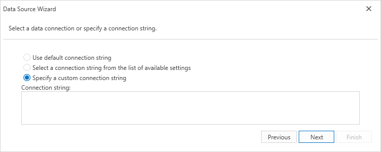

# Select a Connection String

This page allows you to specify a connection string used to establish a data connection. The following options are available:

## Default Connection String

Choose the default connection string if it is specified in the application’s configuration file.

## Custom Connection String

Specify a custom connection string in the connection string editor and choose whether or not to store the string in the application's configuration file.

## Predefined Connection String

Select an existing connection string available in the current project.

Click **Next** to proceed to the next wizard page. If the current Entity Framework model provides stored procedures, go to the [Bind to a Stored Procedure](bind-to-a-stored-procedure.md) page; otherwise, proceed to the [Configure Filters](configure-filters.md) page.