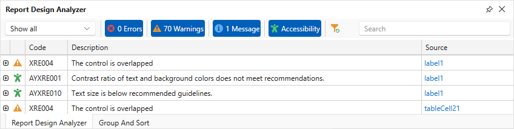

# Report Design Analyzer

The Report Design Analyzer shows errors, warnings, and information messages that help users create or enhance a report layout in the [End-User Report Designer](../../report-designer-for-wpf.md).

## Invoke the Report Design Analyzer

Do one of the following to invoke the **Report Design Analyzer**:

* Select **Report Design Analyzer** from the **Windows** drop-down menu in the **View** toolbar tab.

    

* Click the bell icon in the status bar.

    

## Filter Messages

Based on their source, report errors are divided into four groups:

* Report layout errors – occur, for example, when report controls overlap each other or extend beyond the report’s printable area.
* Report creation errors – occur while the report document is created. For instance, it might include notifications about invalid property values or unreachable sources of content.
* Report export errors – happen while the report document is exported to PDF, XLSX, and other formats.
* Report script errors – for example, errors in script syntax.

When you invoke a WPF Reporting application, the Report Design Analyzer displays messages from all sources except messages that belong to the Report script errors source.

You can disable messages that belong to a particular source:

## Fix Issues

Each message contains a recommendation on how to correct an issue. Click the Plus icon in front of the message to expand the recommendation.

The message's **Source** column contains a reference to the control or script that caused the issue. Click the reference to navigate to this control or script.

## Enable Accessibility Validation

Click the **Accessibility** bar item in the UI panel to display accessibility-related issues in the Report Design Analyzer.

Use filters by type and source to navigate long issue lists:

* Like other report design issues, accessibility issues are divided into errors, warnings, and messages. If you deselect the Warnings button, all accessibility warnings will be hidden.
* The source filter allows you to select report controls where issues originate.
