# Print and Export Reports

## Preview a Report

To display a document preview, switch to the **Print Preview** tab in the Report Designer. You will see your report populated with data and broken down into pages.

> [!NOTE]
> To learn more about the options available in preview mode, refer to the [Document Preview](document-preview.md) section of this documentation.

## Print a Report

When in preview mode, you can print out your report using the toolbar commands.

## Export a Report

When in preview mode, you can export your report to files in different formats.

The following documents describe the basics of report exporting and format-specific export options.
* [Exporting](../../print-preview/print-preview-for-wpf/exporting/exporting.md)
* [PDF-Specific Export Options](../../print-preview/print-preview-for-wpf/exporting/pdf-specific-export-options.md)
* [HTML-Specific Export Options](../../print-preview/print-preview-for-wpf/exporting/html-specific-export-options.md)
* [MHT-Specific Export Options](../../print-preview/print-preview-for-wpf/exporting/mht-specific-export-options.md)
* [RTF-Specific Export Options](../../print-preview/print-preview-for-wpf/exporting/rtf-specific-export-options.md)
* [DOCX-Specific Export Options](../../print-preview/print-preview-for-wpf/exporting/docx-specific-export-options.md)
* [XLS-Specific Export Options](../../print-preview/print-preview-for-wpf/exporting/xls-specific-export-options.md)
* [XLSX-Specific Export Options](../../print-preview/print-preview-for-wpf/exporting/xlsx-specific-export-options.md)
* [CSV-Specific Export Options](../../print-preview/print-preview-for-wpf/exporting/csv-specific-export-options.md)
* [Text-Specific Export Options](../../print-preview/print-preview-for-wpf/exporting/text-specific-export-options.md)
* [Image-Specific Export Options](../../print-preview/print-preview-for-wpf/exporting/image-specific-export-options.md)

## Hide Report Controls in Documents Exported to Specific Formats

You can specify the **Can Publish Options** setting in the Properties panel to exclude report controls from certain export formats.

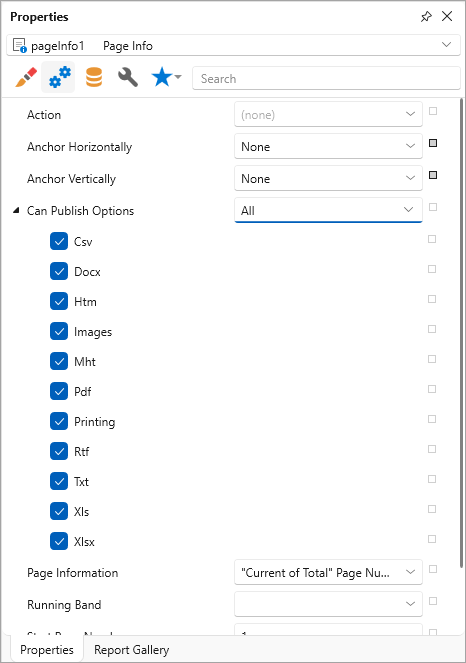

The following image illustrates the resulting XLSX document with and without page information:

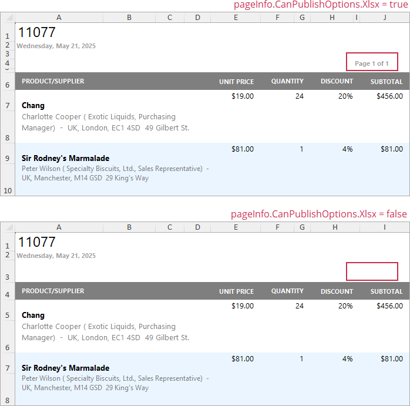

## Export a Report to PDF with Accessible Tags (PDF/UA Compatibility)

Use the **Accessible Role** option to specify how report elements should be treated by screen readers in the exported PDF document. Set the **PDF/UA Compatibility** property to **PDF/UA-1** or **PDF/UA-2** in the [PDF-Specific Export Options](../../print-preview/print-preview-for-wpf/exporting/pdf-specific-export-options.md) to conform the exported PDF document to PDF/UA specifications. Then, export the report as a PDF.

The following image illustrates [PDF Accessibility Checker (PAC)](https://pac.pdf-accessibility.org/en) output after it processes a PDF/UA-compatible exported document:

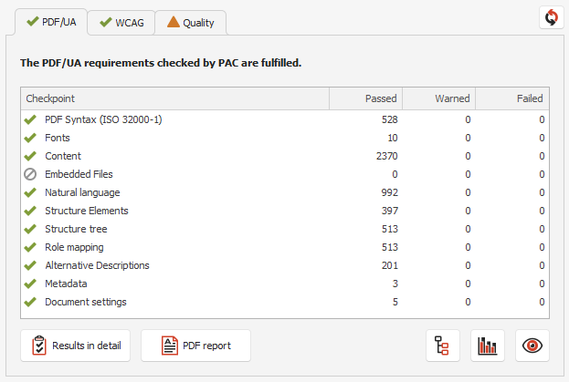

Use this table to map report controls to accessibility structure roles in exported PDF files.

The table describes the following:

- How each control behaves when the **Accessible Role** property is set to **Default**.
- Roles you can assign to ensure that screen readers correctly identify the element's purpose in the exported PDF document.

> [!Tip]
> **Decorative** role means an element is treated as an artifact (outside the tag tree). Use this role only for non-informative visual elements.

| Element(s) | Default behavior when **Accessible Role** = **Default** | Role you can specify |
|---|---|---|
| `Label` | No semantic role; treated as a `Div`. | Heading |
| `Table` | No semantic role; treated as a `Div`. | Table |
| `Table Row` | No semantic role; treated as a `Div`. | Table Header Row |
| `Table Cell` | Treated as a paragraph (`P`). | Header Cell |
| `Watermark` (an image watermark) | Treated as an artifact; excluded from the PDF logical structure. | Figure |
| `Watermark` (a text watermark) | Treated as an artifact; excluded from the PDF logical structure. | Paragraph |
| `Picture Box`, `Shape`, `Bar Code`, `Zip Code` | Treated as a `Figure`. | Decorative (Artifact) |
| `Page Info` | Treated as an artifact; excluded from the PDF logical structure. | Paragraph (use for meaningful content such as dates or page numbers) |
| `Panel` | Included in the document structure. | Decorative (Artifact) (use for layout-only or purely visual panels) |

The **Accessible Description** property is not in effect for artifacts.

> [!NOTE]
> **Rich Text** content is automatically converted to semantic tags when exported to a tagged PDF: headings become `H1`–`H3`, paragraphs become `P`, lists become `L`/`LI`, images become `Figure`, and tables become `Table`/`TR`/`TH`/`TD`. No role configuration is needed.

### Define Label Accessible Role

Set the control's **Accessible Role** property to **Heading 1 - Heading 6** before you export a report.

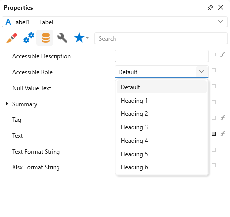

In the PDF-Specific Export Options dialog, set the **PDF/UA Compatibility** property to **PDF/UA-1** or **PDF/UA-2** to conform the exported PDF document to PDF/UA specifications. Then, export the report as a PDF.

The image below shows the result. **Accessible Role** is set to **Heading 2**, and the screen reader treats **Label** as a "level two" heading in the exported document:

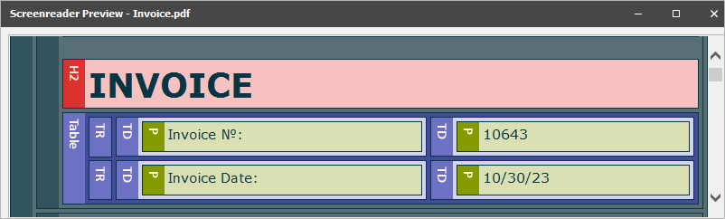

### Define Table Accessible Role

You can specify how a Table should be treated by screen readers in the exported PDF document. To do this, set the control's **Accessible Role** property to **Table** before you export a report.

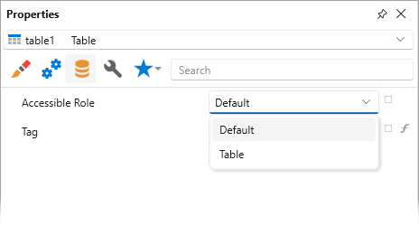

In the PDF-Specific Export Options dialog, set the **PDF/UA Compatibility** property to **PDF/UA-1** or **PDF/UA-2** to conform the exported PDF document to PDF/UA specifications. Then, export the report as a PDF.

The image below shows the result. **Accessible Role** is set to **Table**, and the screen reader treats Table as a table in the exported document:

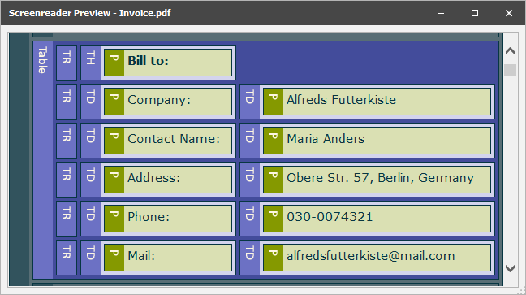

### Define Table Row Accessible Role

You can specify how a Table Row should be treated by screen readers in the exported PDF document.

Before you export a report, set the **Table**'s **Accessible Role** property to **Table** to define a control as a table. Then, specify **Table Row**'s **Accessible Role**:

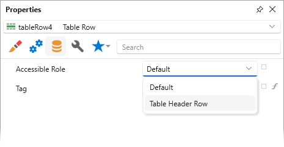

In the PDF-Specific Export Options dialog, set the **PDF/UA Compatibility** property to **PDF/UA-1** or **PDF/UA-2** to conform the exported PDF document to  PDF/UA specification. Then, export the report as a PDF.

The image below shows the result. **Table Row**'s **Accessible Role** is set to **Table Header Row**, and the screen reader treats **Table Row** as a header row of the table in the exported document:

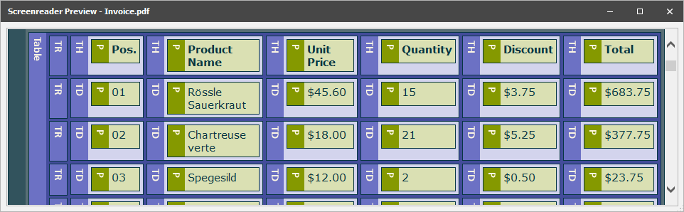

### Define Table Cell Accessible Role

Before you export a report, set the **Table**'s **Accessible Role** property to **Table** to define a control as a table. Then, specify the **Table Cell**'s **Accessible Role** property:

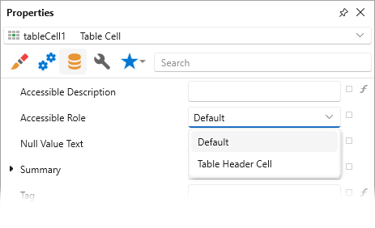

> [!NOTE]
> **Accessible Role** is not in effect for cells merged with the Cell's **Row Span** property.

In the PDF-Specific Export Options dialog, set the **PDF/UA Compatibility** property to **PDF/UA-1** or **PDF/UA-2** to conform the exported PDF document to PDF/UA specifications. Then, export the report as a PDF.

The image below shows the result. The **Table Cell**'s **Accessible Role** is set to **Table Header Cell**, and the screen reader treats the Table Cell with "Bill to:" text as a header cell in the exported document:

### Define Watermark Accessible Role

#### Image Watermark

Use the **Role** property to specify how screen readers interpret image watermarks in exported PDF documents. You can change the value to **Figure** or keep the default value of **Artifact**. An artifact does not appear in the tag tree and is considered external to  content. The **Description** property is not in effect for artifacts.

If an image watermark conveys meaning and you want to include it in the PDF document logical structure, set **Role** to **Figure** when you create or edit the watermark:

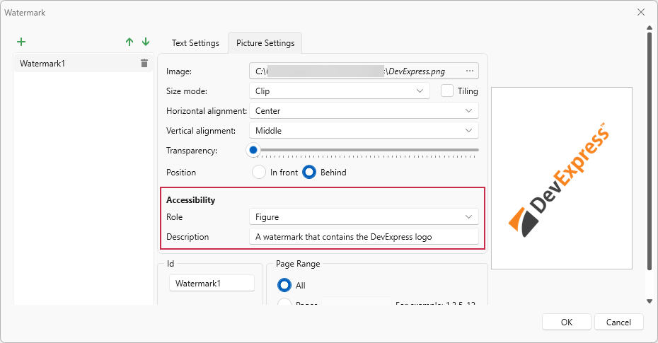

Before you export your report, set the **PDF/UA Compatibility** property to **PDF/UA-1** or **PDF/UA-2** to make the document PDF/UA compatible.

The image below shows the result. **Role** is set to **Figure**, and the screen reader treats the watermark as a figure in the exported document:

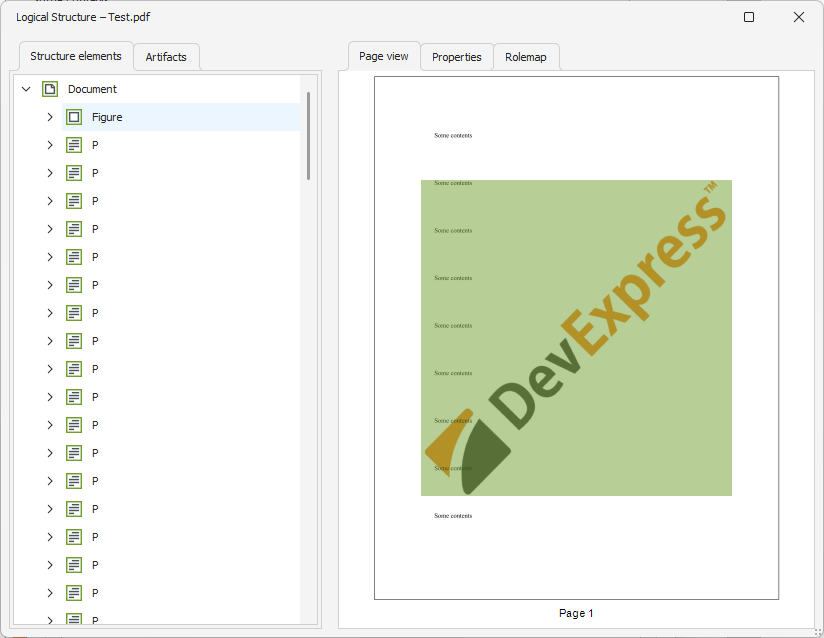

Use the **Description** property to specify the description of the resulting element:

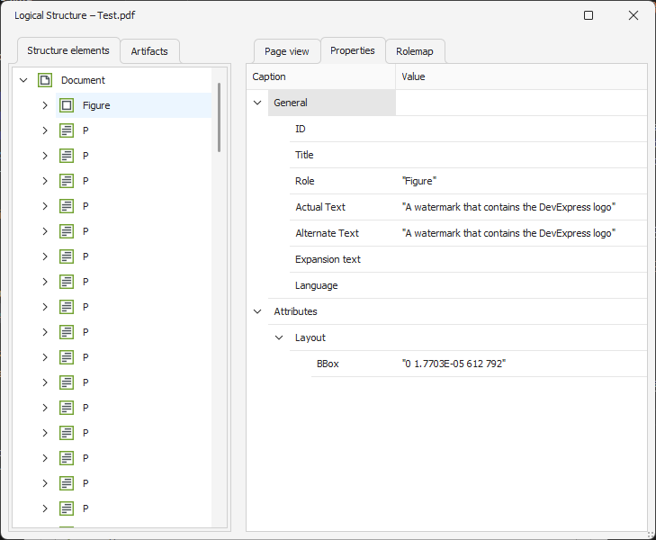

#### Text Watermark

Use the **Role** property to specify how screen readers interpret text watermarks in exported PDF documents. You can change the value to **Paragraph** or keep the default value of **Artifact**. An artifact does not appear in the tag tree and is considered external to content. The **Description** property is not in effect for artifacts.

If a text watermark conveys meaning and you want to include it in the PDF document logical structure, set **Role** to **Paragraph** when you create or edit the watermark:

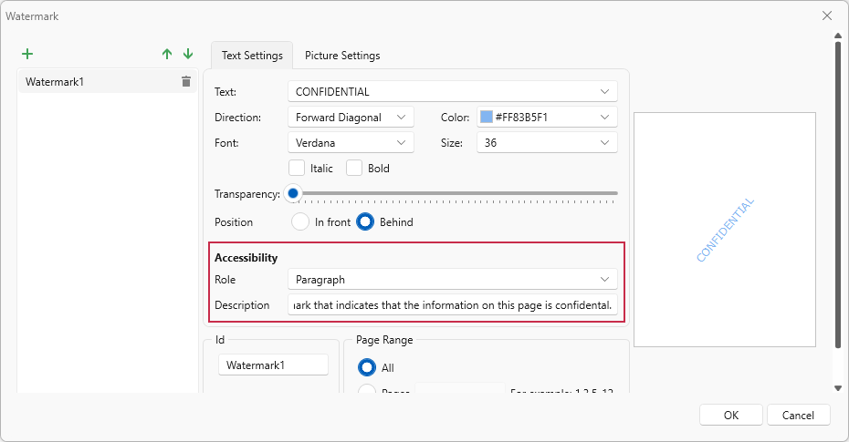

Before you export your report, set the **PDF/UA Compatibility** property to **PDF/UA-1** or **PDF/UA-2** to make the document PDF/UA compatible.

The image below shows the result. **Role** is set to **Paragraph**, and the screen reader treats the watermark as a paragraph in the exported document:

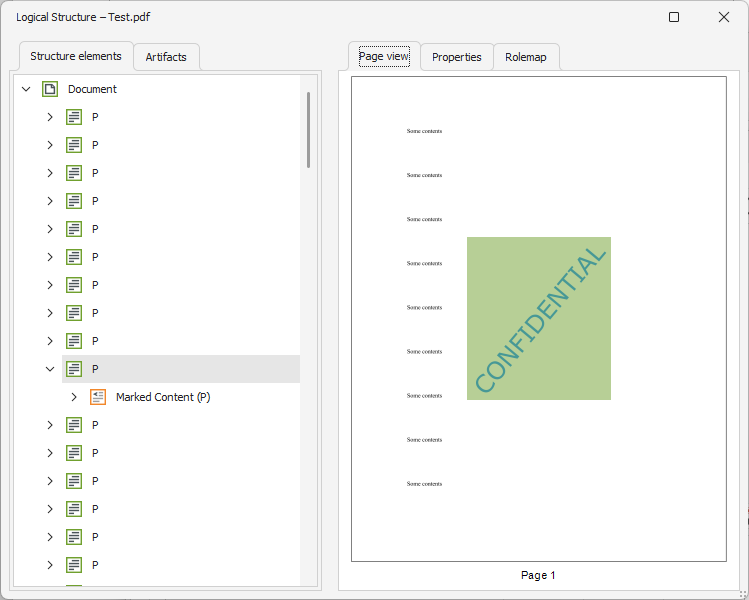

Use the **Description** property to specify the description of the resulting element:

### Hide Elements from the Logical Tree

Use the **Accessible Role** property to specify how screen readers treat **Picture Box**, **Shape**, **Bar Code**, and **Zip Code** controls in exported PDF documents. You can change the value to **Decorative** or keep the default value of **Figure**.

A decorative element is called an artifact and is not part of the PDF document logical structure. An artifact does not appear in the tag tree and is considered external to the content.

> [!NOTE]
> Do not exclude elements that carry meaning; use this role only for decorative elements.

### Digital Signature Accessible Description

You can specify an accessible description for the **PDF Signature** control to help screen readers identify its content.

- **Document Signature**
    If the control displays a document signature, use the **Accessible Description** option in the control's **PDF Signature Options**:

    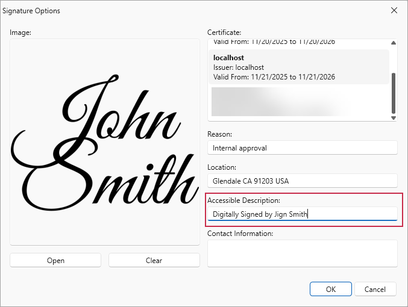

- **Signature Placeholder**
    If the control is a signature placeholder (the document signature is disabled), use the control's **Accessible Description** property:

    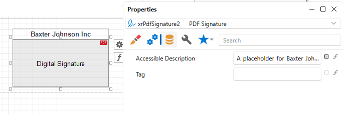

The following image shows both signatures in the PDF tag tree:

### Limitations

* The **Never Embedded Fonts** export option is not supported for PDF/UA-compatible documents.
* If a report contains an **XRPdfContent** control, you cannot export the report to PDF with the PDF/UA option enabled.
* If a report contains editing fields, the exported document does not comply with PDF/UA requirements.
* Hyperlinks are exported without the semantic tags required by **PDF/UA-2**.
