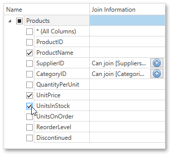

# Customize the Query
On this page, you can construct an SQL query to obtain data from the database or select a stored procedure.
* [Construct a Query](#query)
* [Select a Stored Procedure](#storedprocedure)

<a name="query"/>

## Construct a Query
To construct an SQL query, do the following.
1. Select the **Query** option and click the **Run Query Builder** button.
	
	
2. In the invoked [Query Builder param($match) $path = $match.Groups[1].Value; if ($path -notmatch '^https?://' -and $path -notmatch '^~/' -and $path -notmatch '^\.\./\.\./') { '](' + '../' + $path + '.md)' } else { $match.Value }  window, select an item from the list of available tables on the left and drop it onto the list of data tables to be used.
	
	
3. Enable the check box near the added table to include all of its fields in the data view.
	
	
	
	Click **OK** to exit the **Query Builder**.
	
	For more information on the Query Builder, refer to the [Query Builder param($match) $path = $match.Groups[1].Value; if ($path -notmatch '^https?://' -and $path -notmatch '^~/' -and $path -notmatch '^\.\./\.\./') { '](' + '../' + $path + '.md)' } else { $match.Value }  document.

<a name="storedprocedure"/>

## Select a Stored Procedure
To use a stored procedure, choose the **Stored Procedure** option and then select the required stored procedure from the list.

If the selected query or stored procedure contains any [parameters param($match) $path = $match.Groups[1].Value; if ($path -notmatch '^https?://' -and $path -notmatch '^~/' -and $path -notmatch '^\.\./\.\./') { '](' + '../' + $path + '.md)' } else { $match.Value } , you will be required to define their values on the next wizard page: [Configure Query Parameters param($match) $path = $match.Groups[1].Value; if ($path -notmatch '^https?://' -and $path -notmatch '^~/' -and $path -notmatch '^\.\./\.\./') { '](' + '../' + $path + '.md)' } else { $match.Value } .

Otherwise, clicking **Next** will open the next Report Wizard page: [Choose Columns to Display in a Report param($match) $path = $match.Groups[1].Value; if ($path -notmatch '^https?://' -and $path -notmatch '^~/' -and $path -notmatch '^\.\./\.\./') { '](' + '../' + $path + '.md)' } else { $match.Value } .