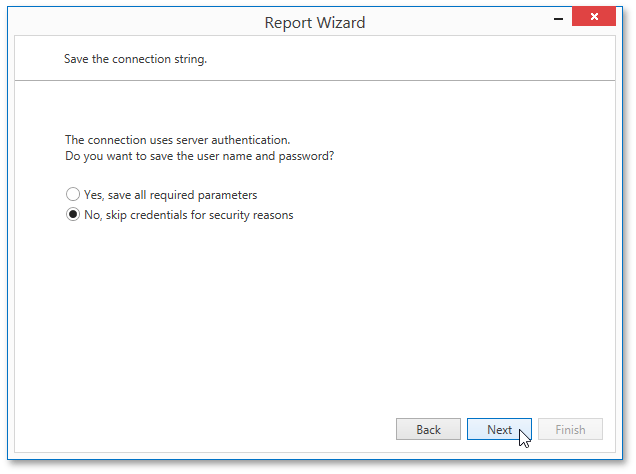

# Save the Connection String
If the data connection uses server authentication, this wizard page allows you to choose whether to save the user credentials along with the connection string.

Click **Next** to proceed to the next wizard page: [Customize the Query param($match) $path = $match.Groups[1].Value; if ($path -notmatch '^https?://' -and $path -notmatch '^~/' -and $path -notmatch '^\.\./\.\./') { '](' + '../' + $path + '.md)' } else { $match.Value } .