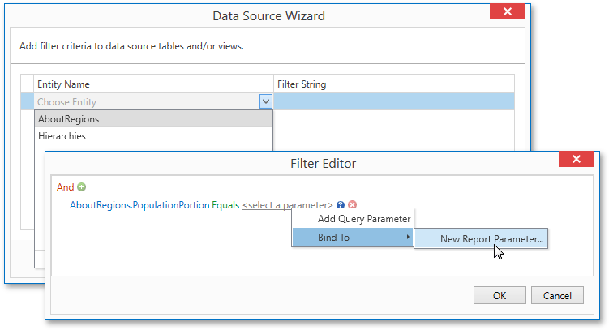

---
title: Configure Filters
author: Margarita Zakhodyaeva
---
# Configure Filters

This wizard page allows you to define any number of [filter criteria](../../../../report-designer-for-winforms/use-expressions.md) for your data source.

The **Filter Editor** is displayed after choosing an entity on this wizard page.

Use this editor to define the selected entity's filter criteria. The filter string can also reference [report parameters](../../../creating-reports/providing-data/report-parameters.md).

