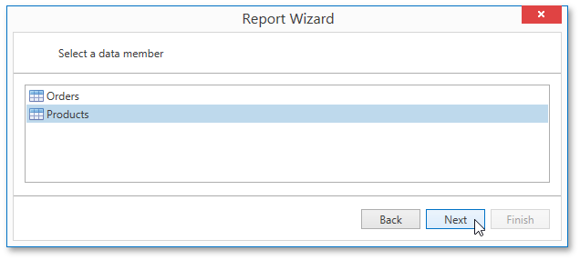

# Select a Data Member
This wizard page allows you to select one of the available data members that will provide data to your report.

Click **Next** to proceed to the next wizard page: [Configure Filters param($match) $path = $match.Groups[1].Value; if ($path -notmatch '^https?://' -and $path -notmatch '^~/' -and $path -notmatch '^\.\./\.\./') { '](' + '../' + $path + '.md)' } else { $match.Value } .