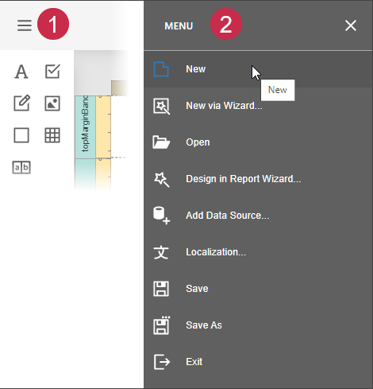

# Add New Reports

This topic explains how to create a new report in the Report Designer.

> [!Note]
> Before you start, make sure to [back up the current report](save-reports.md).

## Create a New Blank Report

In the designer [menu](report-designer-tools/menu.md), click **New**.

The created report contains three [bands](introduction-to-banded-reports.md) - **Top Margin**, **Detail**, and **Bottom Margin**. Refer to the [Use Report Elements](use-report-elements.md) section for information on how to add controls to the report.

## Create a New Report Using the Report Wizard

In the designer [menu](report-designer-tools/menu.md), click **New via Wizard**. 

Go through the wizard's pages to get a predesigned report. For more information about this option, refer to [Report Wizard](report-designer-tools/report-wizard.md).

