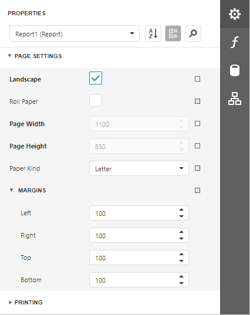

# Change Report Page Settings

You can use default printer settings or specify page settings in Report Designer.

## Specify the Report Page Settings

You can specify the report page settings in the [Properties](../report-designer-tools/ui-panels/properties-panel.md) panel. Expand the **Page Settings** category to access the options:

You can set the page orientation and modify the margins. The margin values are expressed in the report's [measurement units](change-a-report-measurement-units.md). You can select from the predefined paper sizes (**Paper Kind** property), choose **Custom** and create your own paper size.

These settings affect the report layout. After the settings change, you may notice red highlights which indicate that the controls go beyond the page width.

