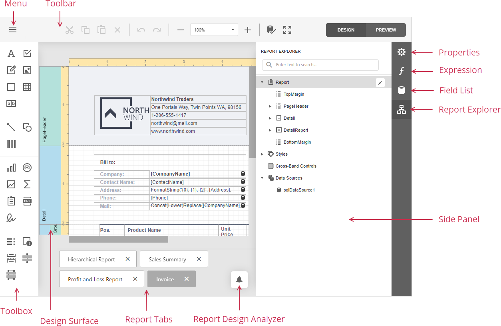

# First Look at the Report Designer

The [Design Surface](report-designer-tools/design-surface.md) displays a report's structure and contents. You can use the tools on the Report Designer's panels to design the report:

- use the [Menu](report-designer-tools/menu.md) to manage and set up reports;

- drop report controls from the [Toolbox](report-designer-tools/toolbox.md) to the design surface;

- access report editing commands in the [Main Toolbar](report-designer-tools/toolbar.md);

- use the [Properties](report-designer-tools/ui-panels/properties-panel.md) panel to set up the report controls;

- use the [Expressions](report-designer-tools/ui-panels/expressions-panel.md) panel to provide data to the report controls and conditionally shape data;

- access the report's data source schema in the [Field List](report-designer-tools/ui-panels/field-list.md) panel;

- access the report's elements in the [Report Explorer](report-designer-tools/ui-panels/report-explorer.md) panel.

