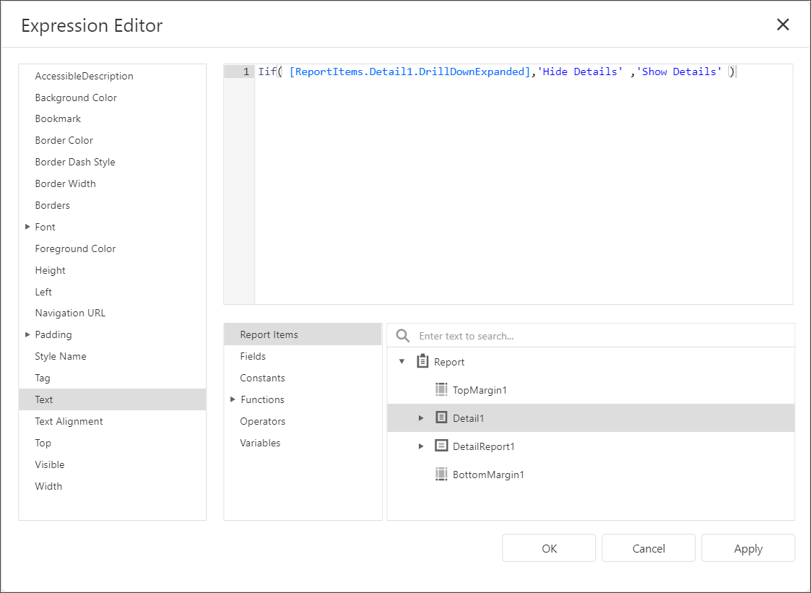

# Create Drill-Down Reports

This tutorial describes how to create a drill-down report. Clicking a link in such a report displays the previously hidden detailed information in the same report:


Do the following to create a drill-down report:

1. [Create a master-detail report using Detail Report bands](../create-reports/master-detail-reports-with-detail-report-bands.md).
2. Drop a label onto the report's detail band. Clicking this label should expand or collapse the hidden report details.
3. Select the [detail report band](../introduction-to-banded-reports.md), open the **Behavior** category and expand the drop-down menu for the band's **Drill-Down Control** property in the [Properties](../report-designer-tools/ui-panels/properties-panel.md) panel.
	
	This menu displays all report controls located in the report band that is one level above the current band. Select the label in the menu to make the label expand or collapse the detail report's band when clicked in the Print Preview.
	
	
	
	You can also specify the band's **Drill-Down Expanded** property to define whether or not the band is initially expanded. This property is enabled by default.
4. Select the label and click the **f-button** to invoke the  [Expression Editor](../report-designer-tools/expression-editor.md).
	
	
	
	The Expression Editor allows you to enter an expression that displays different text based on the detail report's `DrillDownExpanded` property value.

	```
	Iif( [ReportItems.Detail1.DrillDownExpanded],'Hide Details' ,'Show Details' )
	```
	
	

5. Preview the report.