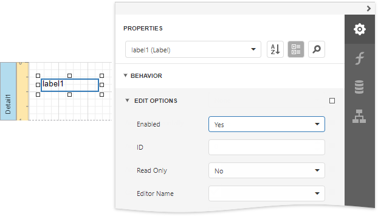
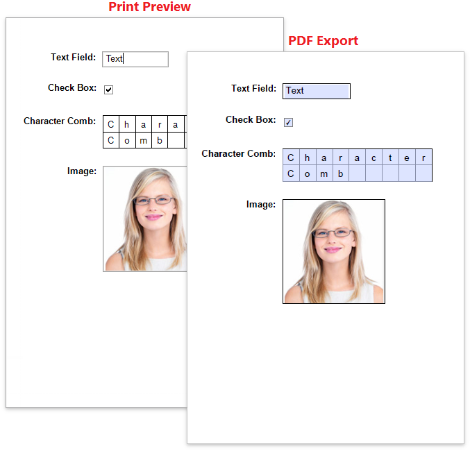

# Edit Content in Print Preview

This document provides information about interactive document editing in Print Preview that enables you to customize field values directly in a previewed document before printing or exporting it.

## Content Editing Overview
When content editing is enabled for a report control (either unbound or data-aware), it is possible to customize the corresponding field values in Print Preview.

To enable content editing for a report control, expand the **Behavior** category, select the **Edit Options** section and set the **Enabled** property to **Yes**.

When the **Enabled** property is set to **Yes** and the **ReadOnly** property is set to **No**, the control's content can be edited in Print Preview (clicking a field will invoke the appropriate editor).

To highlight all editing fields available in a document, click the **Editing Fields**  button on the Print Preview toolbar. This button is disabled when there are no such fields in a document.

### Content Editing Specifics

When enabling content editing in your report, consider the following.

* The changes made to a control's content in Print Preview have no effect on other parts of the document (e.g., the related summary results, grouping, sorting, bookmarks and other settings that have already been processed before generating the document).
* A control's **Can Grow** setting is ignored for editing fields.
	
	Multi-line values can only be entered when no mask is applied to an editing field. The editing area of a field cannot exceed the original dimensions of a control.
* Values entered into editing fields are reset back to their defaults after refreshing the document (e.g., when submitting [report parameter](../use-report-parameters.md) values and expanding or collapsing data in a [drill-down report](create-drill-down-reports.md)).
* It is impossible to edit content of a control that has its **Drill-Down Control** property specified.
* Field values entered in Print Preview for controls placed onto the Top Margin and Bottom Margin bands are not preserved when the report is exported to TXT or CSV, as well as the following formats as a single file.
	
	* HTML
	* MHT
	* RTF
	* XLS
	* XLSX
	* image

To learn about the specifics of editing different kinds of content, see the following sections in this document.

* [Text Editors](#text-editors)
* [Character Comb Editors](#character-comb-editors)
* [Check Box Editor](#check-box-editor)
* [Image Editors](#image-editors)

## Text Editors
The [Label](../use-report-elements/use-basic-report-controls/label.md), [Table Cell](../use-report-elements/use-tables.md) and [Character Comb](../use-report-elements/use-basic-report-controls/character-comb.md) controls can be assigned editors to customize their content in Print Preview.

To enable content editing for these controls, expand the **Behavior** category, select the **Edit Options** section and set the **Enabled** property to **Yes**.

The following editors can be used to customize a field's content in Print Preview.

* **Default Editor**
	
	By default, the **Editor Name** property is not specified, and a memo edit is used as a standard editor.
	
	
* **Specific Value Editors**
	
	You can assign a specific editor to a control using its **Editor Name** property.

    > [!NOTE]
    > This option is disabled for the **Character Comb** control.
	
	
	
	
> [!NOTE]
> If a table cell contains other controls, its editing is disabled (but not the editing of the controls contained in this cell), which is illustrated in the following image.
> 
> 

## Character Comb Editors

The **Character Comb** control displays text so that each character is printed in an individual cell.

Specify the Character Comb's **Edit Options** | **Editor Name** property to use a text editor, as described in the [Text Editors](#text-editors) section above.

## Check Box Editor
The [Check Box](../use-report-elements/use-basic-report-controls/check-box.md) control's value can be edited in Print Preview.

To enable content editing for a check box, expand the **Behavior** category, select the **Edit Options** section and set the **Enabled** property to **Yes**.

In Print Preview, the control's behavior depends on the **Group ID** setting.

* When this property is set to **null** or an empty string value, a check box can be switched either to the "checked" or "unchecked" state (the "intermediate" state is not supported) independently on other available check boxes.
	
	

* Otherwise, the field editor behaves like a radio button, and editors with the same **Group ID** value belong to a single logical group (i.e., only one option can be selected within a group at a time).

## Image Editors

Image editors are used to customize the [Picture Box](../use-report-elements/use-basic-report-controls/picture-box.md) report control's content in Print Preview.

To enable content editing for a picture box, expand the **Behavior** category, select the **Edit Options** section and set the **Enabled** property to **Yes**.

Use the control's **Editor Name** property to assign one of the following image editors.

* **Image Editor**

    Allows you to load an image and specify the image's size options.

    

* **Signature Editor**
    
    Allows you to specify brush options and draw a signature.

    

* **Image and Signature Editor** (default)

    Allows you to load an image and draw a signature. The image's size options and brush options are available.

    

All the image editors listed above can include the  menu item. This item is available only when the Picture Box control has an original image.

## Export Editable Fields to PDF AcroForms

Enable the report's **Export Options | PDF Export Options | Export Editing Fields to AcroForms** property to export [text fields](#text-editors), [check boxes](#check-box-editor), [character combs](#character-comb-editors), and [image editors](#image-editors) to PDF as editable form fields (**AcroForms**).

