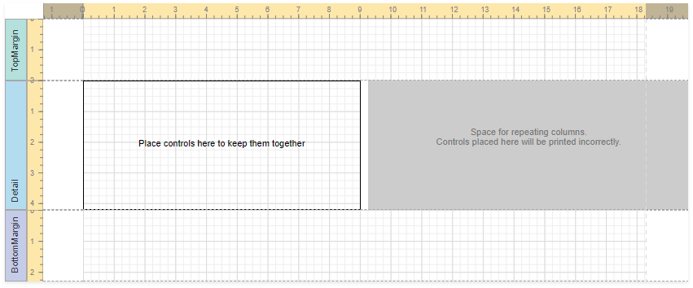

# Label Report

Select **Label Report** on the start page to create a report with labels.

Click **Next** to go to the **Specify Page Settings** page.

## Select the Label Type

Choose a label standard from the **Label Product** drop-down list. Select a label type from the **Product Number** drop-down list. The type defines the label's default size, layout, and paper type.

## Customize Label Parameters

At this step, you can customize the page size and label settings.

Click **Finish** to complete report creation. 

## Result

After the wizard is finished, it divides the report's [Detail band](../../introduction-to-banded-reports.md) into three differently colored areas:

* The area at the left-hand side indicates the actual band area where you can place [controls](../../use-report-elements/use-basic-report-controls.md).
* The gray area at the right-hand side defines the space where label columns are repeated. Do not place controls in this area. 
* The white space specifies the indent between labels.

To provide report data, use the [Data Source Wizard](../data-source-wizard.md).