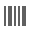
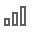

# Toolbox

The **Toolbox** contains available [report controls](../use-report-elements.md) and allows you to add them to your report.

## Report Controls

The available report controls can be divided into the following categories:

### Common Controls

|  |  |  |  |  |  |  | 
| ------------------------------------------------------------- | ------------------------------------------------------------------ | -------------------------------------------------------------------- | -------------------------------------------------------------------- |  -------------------------------------------------------------------- | -------------------------------------------------------------------- | -------------------------------------------------------------------- |
[Label](../use-report-elements/use-basic-report-controls/label.md) | [Check Box](../use-report-elements/use-basic-report-controls/check-box.md) | [Rich Text](../use-report-elements/use-basic-report-controls/rich-text.md) | [Picture Box](../use-report-elements/use-basic-report-controls/picture-box.md) | [Panel](../use-report-elements/use-basic-report-controls/panel.md) | [Table](../use-report-elements/use-tables.md) | [Character Comb](../use-report-elements/use-basic-report-controls/character-comb.md) |

### Additional Controls

|  |  |  |
| ------------------------------------------------------------- | ------------------------------------------------------------------ | -------------------------------------------------------------------- |
| [Line](../use-report-elements/draw-lines-and-shapes/draw-lines.md) | [Shape](../use-report-elements/draw-lines-and-shapes/draw-shapes.md) | [Barcode](../use-report-elements/use-bar-codes.md) |

### Controls with Separate Data Sources

|  |  |  |  |  |  |  | 
| ------------------------------------------------------------- | ------------------------------------------------------------- | ------------------------------------------------------------- | ------------------------------------------------------------- | ------------------------------------------------------------- | ------------------------------------------------------------- | ------------------------------------------------------------- |
[Chart](../use-report-elements/use-charts.md) | [Gauge](../use-report-elements/use-gauges-and-sparklines/add-gauges-to-a-report.md) |[SparkLine](../use-report-elements/use-gauges-and-sparklines/add-sparklines-to-a-report.md) |[Cross Tab](../create-reports/cross-tab-reports.md) | [Subreport](../use-report-elements/use-basic-report-controls/subreport.md) | [PDF Content](../use-report-elements/use-basic-report-controls/pdf-content.md) | [PDF Signature](../use-report-elements/use-basic-report-controls/pdf-signature.md) |

### Layout and Auxiliary Content Controls

|  |  |  |  |  |
| ------------------------------------------------------------- |------------------------------------------------------------------ |------------------------------------------------------------------ | -------------------------------------------------------------------- |-------------------------------------------------------------------- |
| [Table of Contents](../use-report-elements/use-basic-report-controls/table-of-contents.md) | [Page Info](../use-report-elements/use-basic-report-controls/page-info.md) | [Page Break](../use-report-elements/use-basic-report-controls/page-break.md) | [Cross-Band Line](../use-report-elements/draw-lines-and-shapes/draw-cross-band-lines-and-boxes.md) | [Cross-Band Box](../use-report-elements/draw-lines-and-shapes/draw-cross-band-lines-and-boxes.md)

## Add a Control to a Report

To add a control from the Toolbox, drag and drop an item from the Toolbox onto the required location within a report.
	

