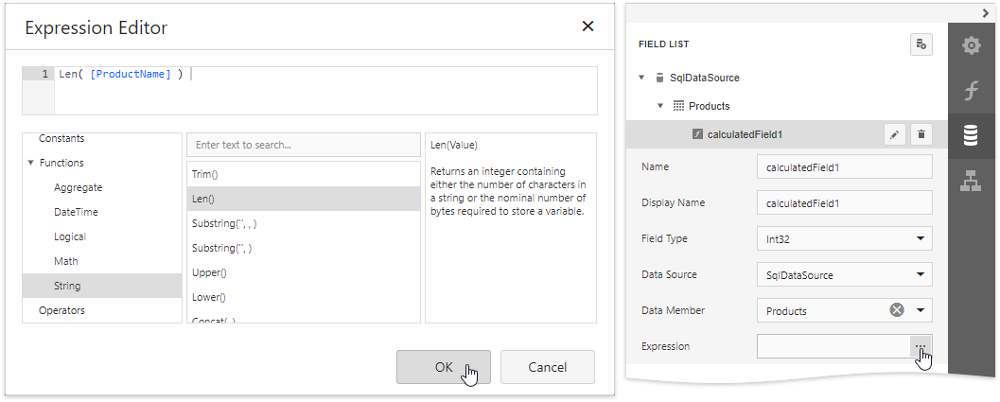
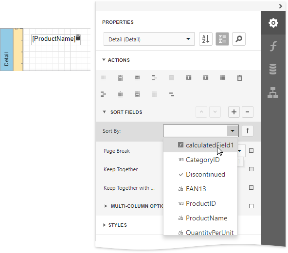
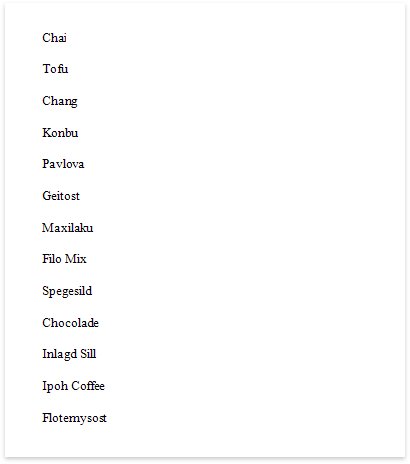

# Sort Data by a Custom Field

This tutorial illustrates how to sort a report against a custom criteria, in particular, sort data by the number of characters in the data field value. 

1. Create a new or open an existing data-bound report.
	
	You cannot apply grouping unless your report is bound to a data source.

2. Create a [calculated field](../use-calculated-fields.md). Switch to the [Field List](../../report-designer-tools/ui-panels/field-list.md) panel, select the data source or a table inside it and click **Add Calculated Field**.
	
		

3. Click the **Edit** button for the calculated field and then click the **Expression** property's ellipsis button. In the invoked [Expression Editor](../../report-designer-tools/expression-editor.md), select the required date-time function and define the data field's name in **[**square brackets**]**. For example,  use the **Len([ProductName])** function to return the number of characters extracted from the **ProductName** data field.
	
	
	
	Click **OK** to close the editor and save the changes.

4. Switch to the [Properties](../../report-designer-tools/ui-panels/properties-panel.md) panel and select the [Detail](../../introduction-to-banded-reports.md) band. Select the **Sort Fields** section in the **Detail Tasks** category and add a new sort field to sort the report's data by the calculated field.
	
	
	
    Click the  or  buttons to define the sort order within the group (ascending or descending).
    Use the  button to disable sorting in grouped data.

6. Drag the corresponding field from the [Field List](../../report-designer-tools/ui-panels/field-list.md) onto the report area and switch to [Print Preview](../../preview-print-and-export-reports.md) to see the result.

    