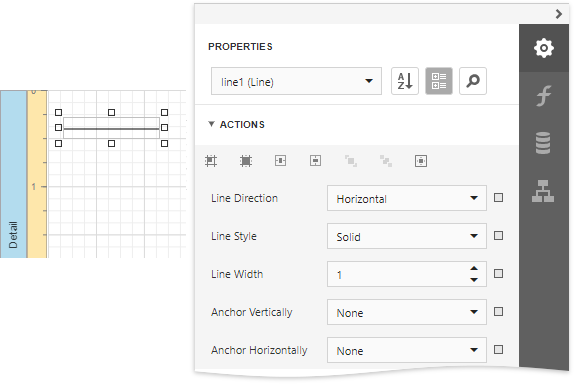
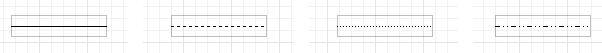

# Draw Lines

The **Line** control draws a line in a specified direction, style, width, and color. You can use it to decorate and visually separate a report's sections.

To add a line to a report, drag the **Line** item from the [Toolbox](../../report-designer-tools/toolbox.md) onto the report's area.

The **Line  Tasks** category of the [Properties](../../report-designer-tools/ui-panels/properties-panel.md) panel provides the main control properties:

* **Line Direction**
	
	Enables you to draw a line horizontally, vertically, and across the rectangle the line occupies from one corner to another (**Horizontal**, **Vertical**, **Slant** and **Back Slant** types).
	
	

* **Line Style**
	
	You can select the solid (by default), dashed, dotted, or mixed line style.
	
	

* **Line Width**
	
	Specifies the line width in pixels as a floating point value.

* **Anchor Vertically**
	
	Specifies the vertical anchoring style, so that after page rendering a control stays attached to the top control, bottom control, or both.

> [!Note]
> The **Line** control cannot span several bands. See [Draw Cross-Band Lines and Boxes](draw-cross-band-lines-and-boxes.md) to learn about drawing lines through several bands.