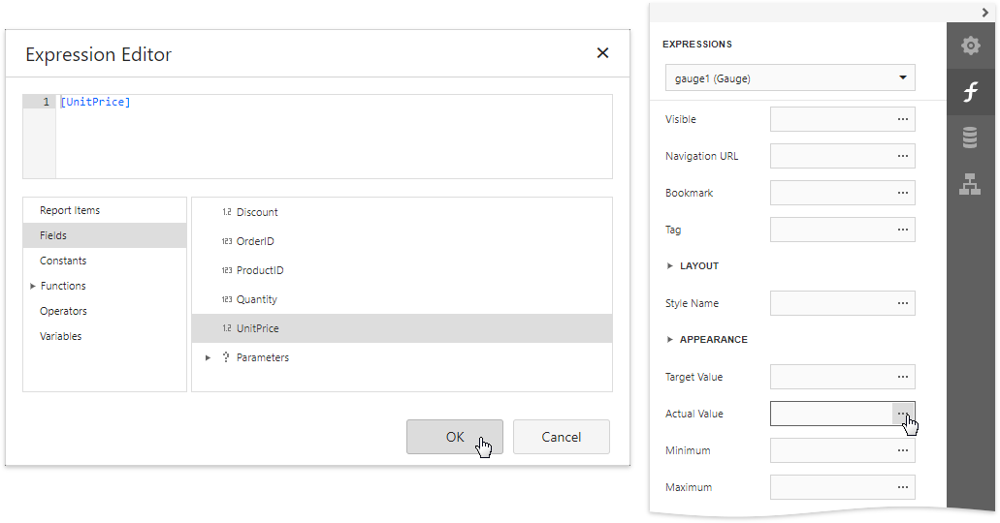

# Add Gauges to a Report

## Gauge Overview

The **Gauge** control provides you with the capability to embed graphical gauges into your report.

To add this control to the report, drag the **Gauge** item from the [Toolbox](../../report-designer-tools/toolbox.md) and drop it onto the report.

Specify properties in the **Gauge Tasks** category to set up a gauge's appearance.

* **View**
	
	Specifies the type of the displayed gauge. The following view types are available:

    * **Linear**
		
		
		
		Supported view styles: **Horizontal** and **Vertical**.
	
	* **Circular**
		
		
		
		Supported view styles: **Full**, **Half**, **Quarter Left**, **Quarter Right** and **Three Fourth**.

* **Theme**
	
	Specifies the gauge's color theme. The **Flat Light** and **Flat Dark** view themes are supported.
	
	

The following properties allow you to customize the gauge scale and specify its displayed values.

* **Actual Value** - specifies the value displayed by a gauge.
* **Target Value** - specifies the position of the target value marker.
* **Maximum** - specifies the gauge's maximum value.
* **Minimum** - specifies the gauge's minimum value.

## Bind a Gauge to Data
To [bind](../bind-controls-to-data.md) the gauge's displayed value to data, open the [Expressions](../../report-designer-tools/ui-panels/expressions-panel.md) panel and click the **Actual Value** property's ellipsis button. Select the required data field or construct a complex binding expression involving two or more data fields in the invoked [Expression Editor](../../report-designer-tools/expression-editor.md).

In the same way, you can bind the **Target Value**, **Minimum** and **Maximum** properties to data.