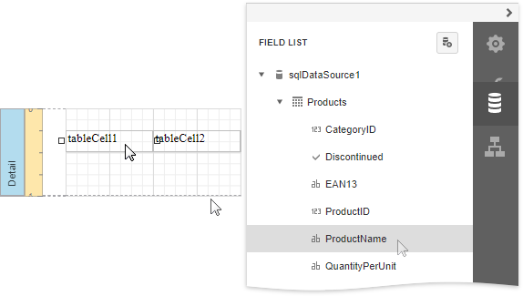
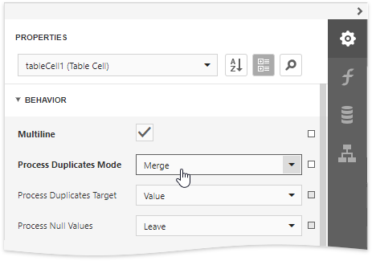

# Bind Table Cells to Data

Use the [Field List](../../report-designer-tools/ui-panels/field-list.md) to create a table control with cells [bound](../bind-controls-to-data.md) to data fields obtained from a report's data source. 

Hold CTRL or SHIFT and click multiple data fields to select them. Drop the selected data fields onto the Detail band.

You can bind individual table cells to data in the same ways as [Label](../use-basic-report-controls/label.md) controls. Drop a data field onto an existing cell to bind this cell to the corresponding field.

Use the [Expression Editor](../../report-designer-tools/expression-editor.md) to construct a complex binding expression with two or more data fields. Click the **Text** property's marker and select **Text Expression** from the popup menu to invoke the Expression Editor.

See the [Bind Report Controls to Data](../bind-controls-to-data.md) topic for information on how to create data-aware controls.

The **Process Duplicates Mode** and **Process Duplicates Target** options enable you to merge cells with identical values.

