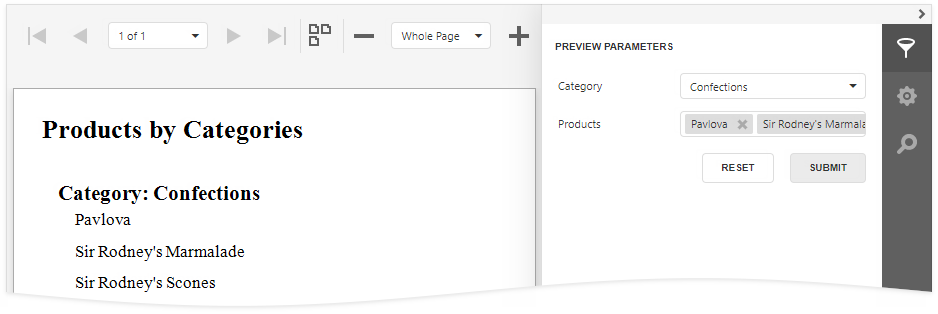
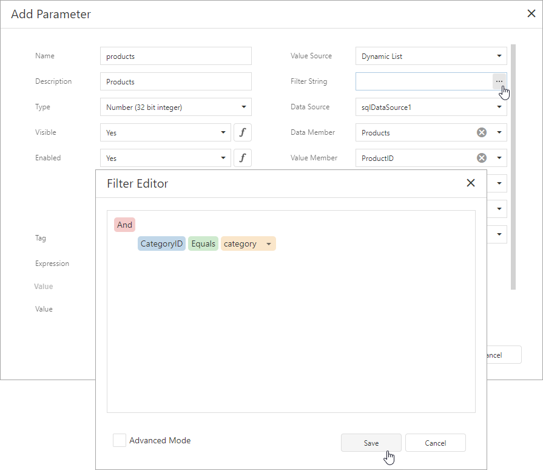

# Cascading Report Parameters

You can create cascading parameters to filter a list of predefined parameter values based on values in another parameter.

> [!TIP]
> Refer to the following topics for information on how to create a list of predefined parameter values:
> * [Report Parameters with Predefined Static Values](report-parameters-with-predefined-static-values.md)
> * [Report Parameters with Predefined Dynamic Values](report-parameters-with-predefined-dynamic-values.md)

Follow the steps below to create cascading parameters in the [Report Designer](../first-look-at-the-report-designer.md):

1. [Create a report parameter](create-a-report-parameter.md) you want to use to filter values of another parameter.

    

2. Create a report parameter whose values you want to filter. Click the **Filter String** property's ellipsis button in the **Add New Parameter** dialog and specify a filter string that references the parameter you created in the first step.

    

    > [!NOTE]
    > In a filter string for a parameter's look-up values, you can reference only those parameters that you created before the parameter whose look-up values you want to filter. You can use the **Report Parameters Editor** to change the order in which you created the parameters. To invoke the editor, right-click the **Parameters** node in the [Field List](../report-designer-tools/ui-panels/field-list.md) and select **Edit Parameters**.

3. In the report's smart tag, click the **Filter String** property's ellipsis button. In the invoked **FilterString Editor**, specify an expression that uses both parameters to filter report data:

    

The following image illustrates cascading parameters where the **Product** parameter values are filtered by the selected **Category**.

