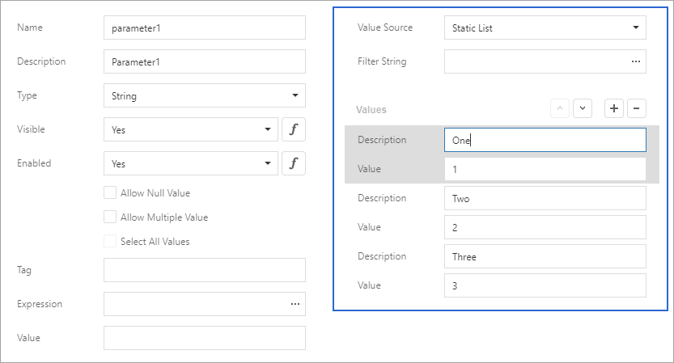

# Report Parameters with Predefined Static Values

You can create a list of predefined values for a report parameter.

When you open a report's **Print Preview**, you can select a value from this list in the [Parameters panel](parameters-panel.md).

## Create a List of Predefined Values in the Report Designer

Follow the steps below to create a parameter with a list of predefined static values in the [Report Designer](../first-look-at-the-report-designer.md):

1. Create a report parameter as described in this topic: [Create a Report Parameter](create-a-report-parameter.md).
2. Set the parameter's **Value Source** option to **Static List**. A grid appears in the **Add New Parameter** dialog and allows you to specify a list of static parameter values. 

    

    Each value should have a description. This description is displayed in the [Parameters panel](parameters-panel.md).
