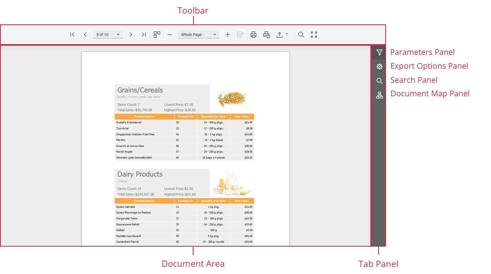

# Document Viewer

The Web Document Viewer displays an interactive preview of a document generated from a report. The Document Viewer allows users to view, print, and export the report document.

The Viewer toolbar contains commands to navigate, print, and export the document. The **Tab Panel** on the right provides access to the **Parameters Panel** to specify report parameters, the **Export Options Panel** to configure format-specific export settings, the **Search Panel** to search for text in the document, and the **Document Map Panel** to navigate bookmarks.

Refer to the following topics for details on how to use the Web Document Viewer:

## View and Navigate

* [Navigate Between Pages](document-viewer/viewing-and-navigating/navigate-between-pages.md)
* [Navigate Using Bookmarks](document-viewer/viewing-and-navigating/navigate-using-bookmarks.md)
* [Search for a Specific Text](document-viewer/viewing-and-navigating/search-for-a-specific-text.md)
* [Switch Multipage Mode](document-viewer/viewing-and-navigating/switch-display-mode.md)
* [Zoom](document-viewer/viewing-and-navigating/zooming.md)

## Interactivity

* [Edit Content](document-viewer/content-editing.md)

## Parameters

* [Specify Parameter Values](document-viewer/passing-parameter-values.md)

## Print a Report

* [Print a Report](document-viewer/printing.md)

## Export

* [Export a Document](document-viewer/exporting/export-a-document.md)
* [CSV-Specific Export Options](document-viewer/exporting/csv-specific-export-options.md)
* [HTML-Specific Export Options](document-viewer/exporting/html-specific-export-options.md)
* [Image-Specific Export Options](document-viewer/exporting/image-specific-export-options.md)
* [MHT-Specific Export Options](document-viewer/exporting/mht-specific-export-options.md)
* [PDF-Specific Export Options](document-viewer/exporting/pdf-specific-export-options.md)
* [RTF-Specific Export Options](document-viewer/exporting/rtf-specific-export-options.md)
* [Text-Specific Export Options](document-viewer/exporting/text-specific-export-options.md)
* [XLS-Specific Export Options](document-viewer/exporting/xls-specific-export-options.md)
* [XLSX-Specific Export Options](document-viewer/exporting/xlsx-specific-export-options.md)