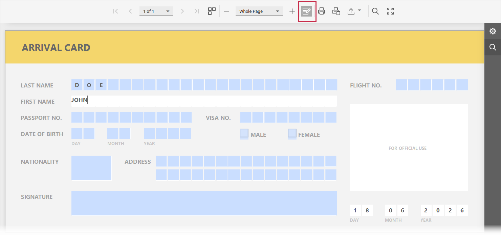

# Edit Content

A report may contain elements with editable fields, and you can edit field values in the Document Viewer.

To highlight all editable fields in the document, click the **Highlight Editing Fields** button on the toolbar. This button is disabled if there are no such fields in the document.

When you click an editable field, the Document Viewer opens the appropriate editor. You can edit text in labels and table cells, and switch check box states. For image elements, you can change pictures and specify size mode and alignment.
