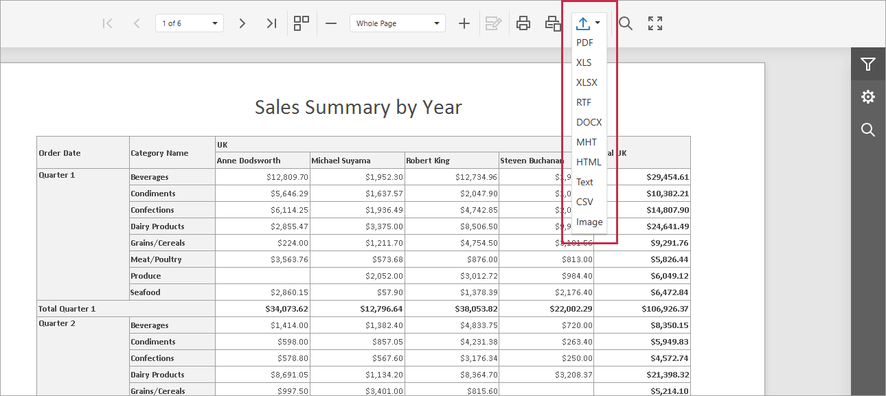
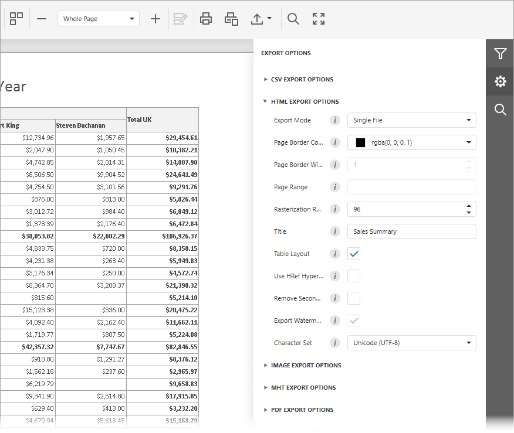

# Export a Document

To export a document, click the **Export To** button on the Document Viewer toolbar and select a format from the drop-down list. The available formats are PDF, XLS, XLSX, RTF, DOCX, MHT, HTML, Text, CSV, and Image.

Once you select the export format, the document export begins. The browser may prompt you to save the file or open it in an associated application.

## Export Options

To configure export options before you export, open the **Export Options Panel** from the **Tab Panel** on the right.

Options are grouped by export format. Click a group header to expand it. Refer to the following topics for format-specific options:

* [CSV Export Options](csv-specific-export-options.md)
* [HTML Export Options](html-specific-export-options.md)
* [Image Export Options](image-specific-export-options.md)
* [MHT Export Options](mht-specific-export-options.md)
* [PDF Export Options](pdf-specific-export-options.md)
* [RTF Export Options](rtf-specific-export-options.md)
* [Text Export Options](text-specific-export-options.md)
* [XLS Export Options](xls-specific-export-options.md)
* [XLSX Export Options](xlsx-specific-export-options.md)
* [DOCX Export Options](docx-specific-export-options.md)