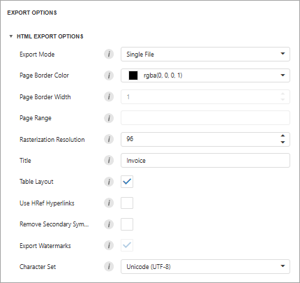

# HTML Export Options
Before you [export a document](export-a-document.md) to HTML format, you can specify HTML-specific options in the **Export Options** panel.

* **Export Mode**

	
	Specifies how a document is exported to HTML. The following modes are available.
	* The **Single File** mode allows you to export a document to a single file, without preserving the page-by-page breakdown.
	* The **Single File PageByPage** mode allows you to export a document to a single file, while preserving the page-by-page breakdown. In this mode, the **Page Border Color**, **Page Border Width**, and **Page Range** options are available.
* **Page Border Color**
	
	Specifies page border color.
* **Page Border Width**
	
	Specifies page border width (in pixels).
* **Page Range**
	
	Specifies a range of pages that will be included in the resulting file. To separate page numbers, use commas. To set page ranges, use hyphens.
* **Rasterization Resolution**
	
	Specifies raster image resolution.
* **Title**
	
	Specifies the title of the created document.
* **Table Layout**
	
	Specifies whether to use a table or non-table layout in the resulting document.
	
* **Remove Secondary Symbols**
	
	Specifies whether to remove all secondary symbols (such as **Space** and **Carriage Return**) in the resulting document to reduce its size.
* **Export Watermarks**
	
	Specifies whether to include watermarks in the exported document.
* **Character Set**
	
	Specifies the character set for the HTML document.