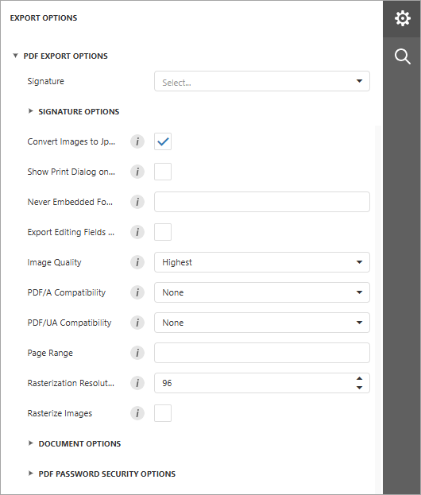

# PDF Export Options

Before you [export a document](export-a-document.md) to PDF, you can specify PDF-specific options in the **Export Options** panel.

## General Options

* **Signature**

	Use the drop-down list to select a certificate to sign the exported PDF document.

	Expand **Signature Options** to review or edit the following fields before export. The fields are pre-populated from the selected certificate, and changes affect only the exported document.

	* **Reason** — the reason for signing.
	* **Location** — the location where the document is signed.
	* **Contact Info** — contact information for the signer.
	* **Accessible Description** — a description used by screen readers to identify the signature.
* **Convert Images to JPEG**
	
	Specifies whether to convert all bitmaps to JPEG during export.
* **Show Print Dialog on Open**
	
	Specifies whether to display the **Print** dialog when the user opens the resulting PDF file in a PDF viewer.
* **Never Embed Fonts**
	
	Specifies font names that should not be embedded into the resulting file. To separate fonts, use semicolons.
* **Export Editing Fields to AcroForms**
	
	Specifies whether to convert report editing fields to interactive forms.
* **Image Quality**
	
	Specifies the image quality level. The higher the quality, the bigger the file, and vice versa.
* **PDF/A Compatibility**
	
	Specifies document compatibility with PDF/A specification (PDF/A-1a, PDF/A-1b, PDF/A-2a, PDF/A-2b, PDF/A-3a, PDF/A-3b).
* **PDF/UA Compatibility**

	Specifies whether to conform the exported PDF document to the PDF/UA (Universal Accessibility) standard. The following values are available:
	* **PDF/UA-1** — based on **ISO 14289-1** and PDF 1.7.
	<!-- * **PDF/UA-2** — based on **ISO 14289-2** and PDF 2.0. -->
* **Page Range**
	
	Specifies a range of pages that will be included in the resulting file. To separate page numbers, use commas. To set page ranges, use hyphens.
* **Rasterization Resolution**
	
	Specifies the resolution (in DPI) used for rasterized images.
* **Rasterize Images**

	Specifies whether to rasterize vector images during export.

## Document Options
The **Document Options** complex property contains options that specify the **Document Properties** of the created PDF file. Click the complex property's header to access its nested options.

## PDF Password Security Options
This complex property allows you to adjust the security options of the resulting PDF file.

* **Open Password**
	
	Specifies the password for opening the exported PDF document.
* **Encryption Level**
	
	Specifies the algorithm used to encrypt PDF content.
* **Permissions Password**
	
	Specifies the PDF permissions password for the document.
* **PDF Permissions Options**
	
	Provides access to the options that specify permissions for printing, changing, copying, and accessing the exported document.
