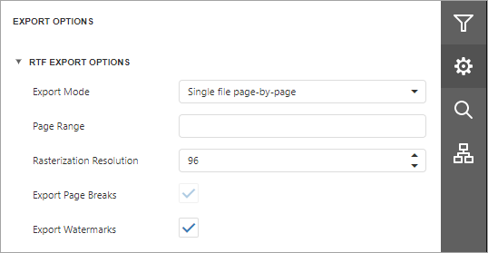

# RTF Export Options

Before you [export a document](export-a-document.md) to RTF, you can specify RTF-specific options in the **Export Options** panel.

* **Export Mode**
	
	Specifies how a document is exported to RTF. The following modes are available.
	* The **Single File** mode allows you to export a document to a single file without preserving the page-by-page breakdown.
	* The **Single File PageByPage** mode allows you to export a document to a single file while preserving the page-by-page breakdown. In this mode, the **Page Range** and **Export Watermarks** options are available.
* **Page Range**
	
	Specifies a range of pages to include in the resulting file. To separate page numbers, use commas. To set page ranges, use hyphens.
* **Rasterization Resolution**
	
	Specifies the image resolution for raster images.
* **Export Page Breaks**
	
	Specifies whether to include page breaks in the exported RTF file.

* **Export Watermarks**
	
	Specifies whether to include watermarks (if any) in the resulting file.