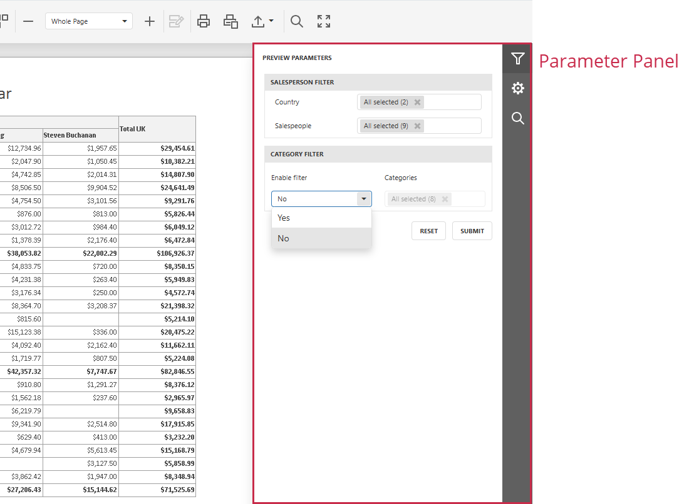

# Specify Parameter Values

A report may contain parameters that allow you to control the data displayed in the document.

To open the **Parameters Panel**, click the **Parameters** tab in the **Tab Panel** on the right. This panel allows you to specify parameter values that apply when the document preview is generated.

Use the parameter editor to specify a value and click **Submit**. To restore the original values, click **Reset**.
