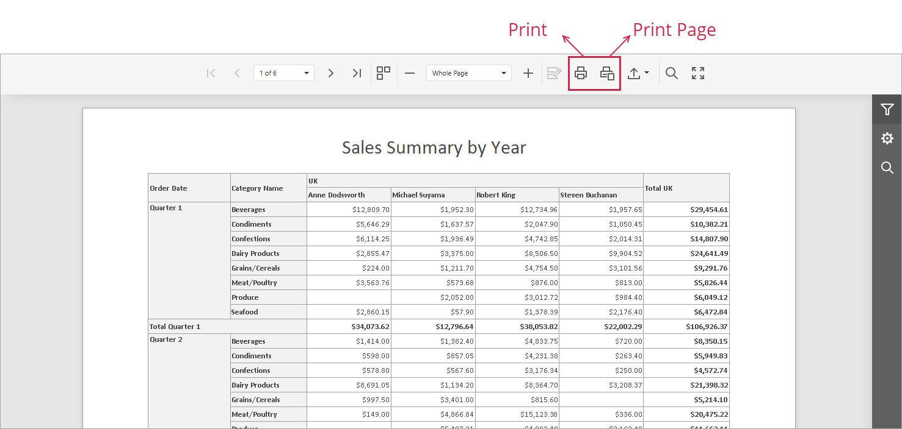
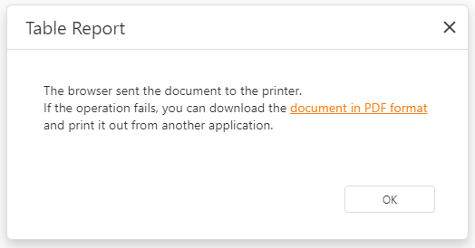

# Print a Document

To print the document, click the **Print** button on the Viewer toolbar. Click **Print Page** to print only the currently displayed page.

The built-in PDF viewer in browsers allows you to select the destination and specify print settings. Click the **Print** toolbar item to open the **Print** dialog:

The Document Viewer uses the browser's built-in PDF viewer for printing. Printing does not work if the PDF viewer is unavailable or the browser is configured not to open PDF files automatically. In this case, the Document Viewer downloads the report as a PDF file. The file contains a script that opens the **Print** dialog when you open the PDF in a PDF reader.

