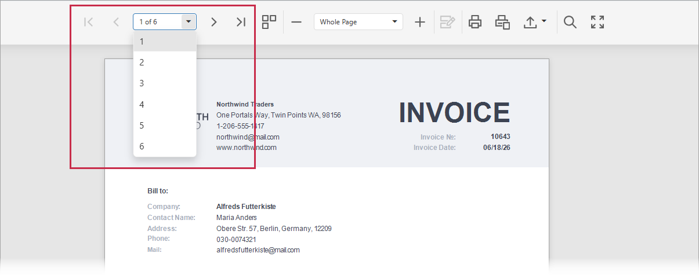

# Navigate Between Pages

To navigate to a specific page of a document, select the page number in the drop-down list in the Document Viewer toolbar. Use the navigation buttons to go to the first, previous, next, or last page.

