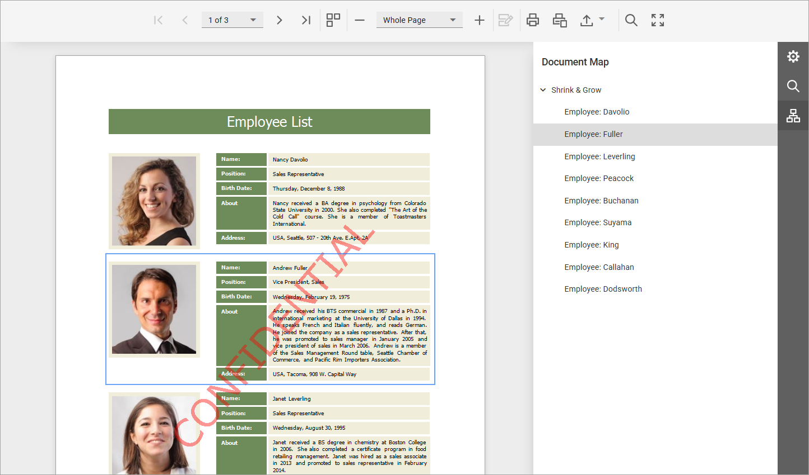

# Navigate Using Bookmarks

If a report contains bookmarks, the **Document Map Panel** is available in the **Tab Panel** on the right.

To open the **Document Map Panel**, click the **Document Map** tab. Click a bookmark to navigate to that page; the Document Viewer highlights the associated element.

