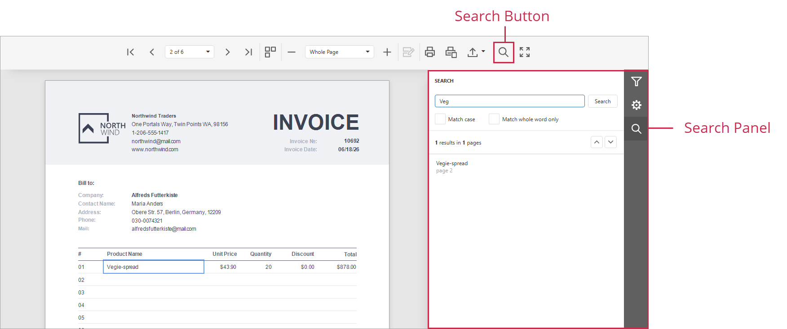

# Search for Text

To search for text in a document, click the **Search** tab in the **Tab Panel** or the **Search** button in the toolbar.

In the **Search Panel**, enter a search string and select options for case-sensitive search or whole-word matching. Press <kbd>Enter</kbd> or click **Search** to start. Click **Stop** to cancel. Use the **Up** and **Down** buttons to move between results.

The **Search Panel** lists all matches in the document. Click an item in the **Search Result** list to navigate to that location; the Document Viewer highlights the matching element.