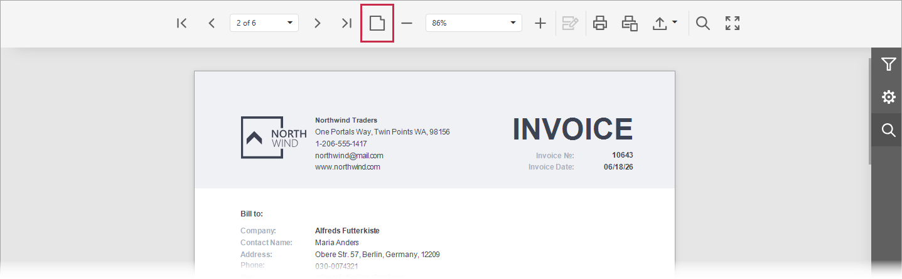
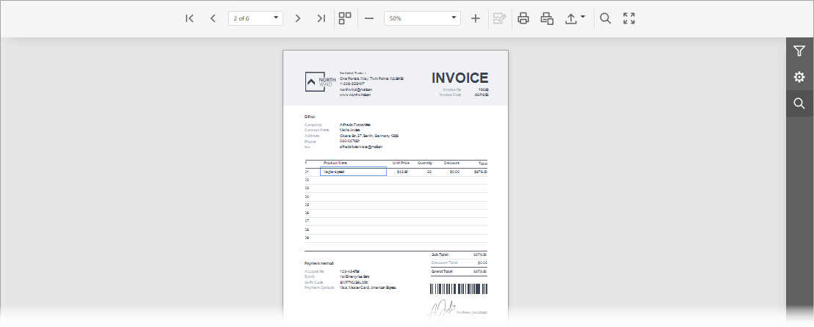
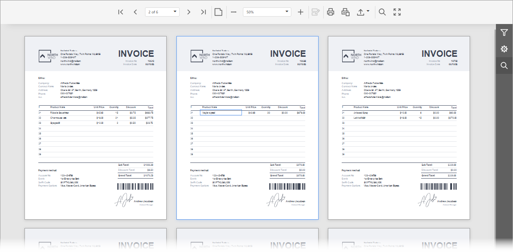

# Switch Between Single Page and Multipage View

You can switch between the Single Page and MultiPage modes with the **Toggle Multipage Mode** button located in the Document Viewer toolbar.

In the default single page mode, the Document Viewer displays only one page. You can navigate between document pages with the navigation buttons and dropdown list (see [Navigate Between Pages](navigate-between-pages.md)).

In the multipage mode, the Document Viewer displays several document pages. In addition to the standard navigation features, there is a vertical scroll bar that allows you to scroll through pages.

