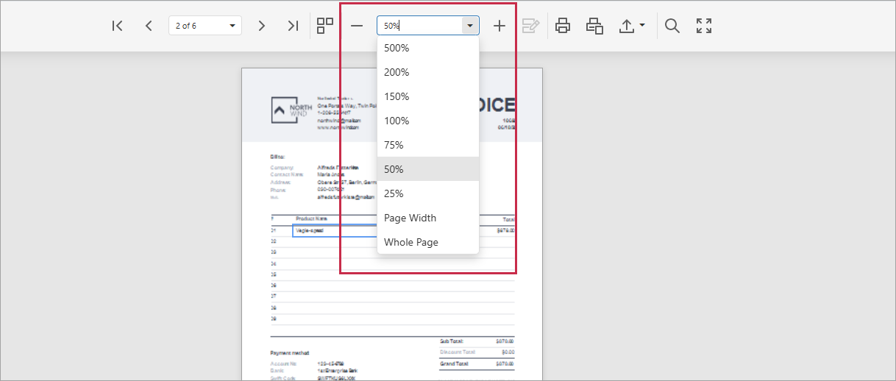

# Zoom

To zoom in or out of a document, click the **Zoom In** or **Zoom Out** button on the Document Viewer toolbar. These buttons change the current zoom factor by 5 percent. You can enter a zoom factor in the combo box editor or select a preset from the drop-down list.

