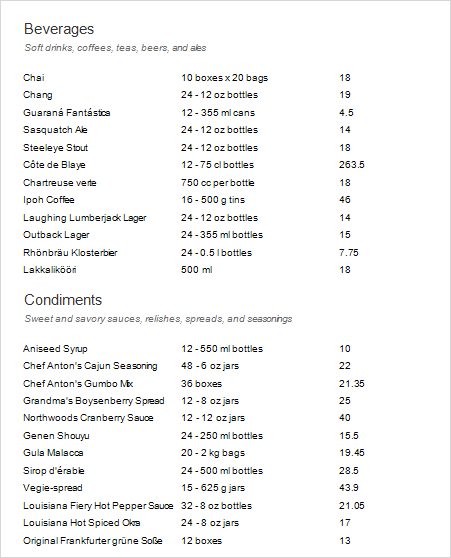
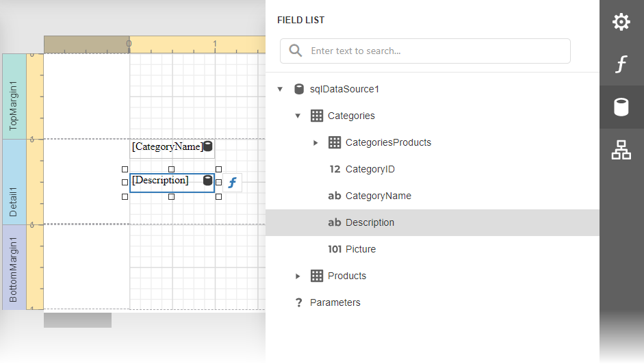
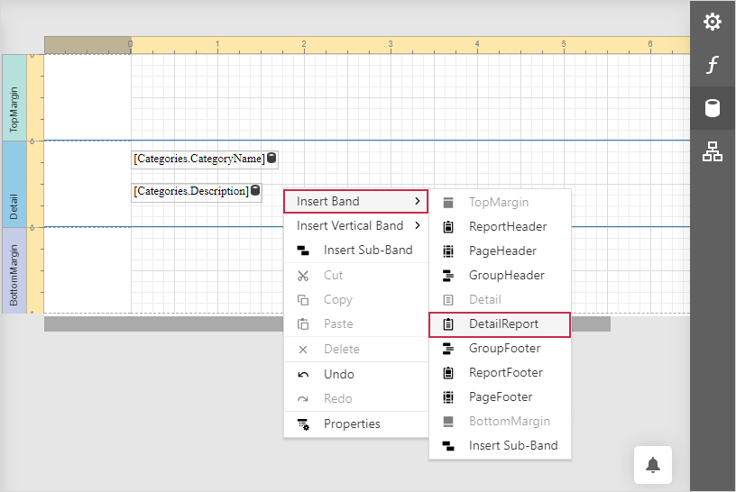
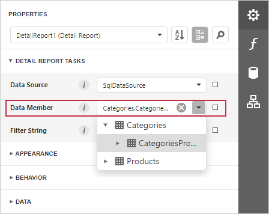
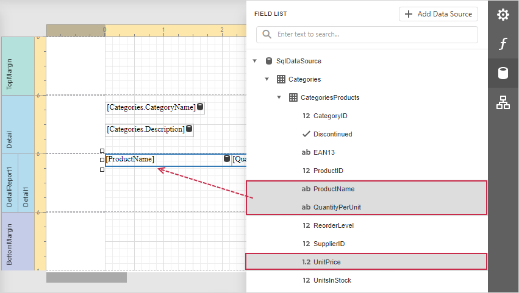

# Master-Detail Report with Detail Report Bands

This tutorial illustrates how to display hierarchical data in a master-detail report using nested [Detail Report bands](../introduction-to-banded-reports.md). This technique is effective if your data source contains a master-detail relationship. Another technique is described in the following topic: [Master-Detail Reports with Subreports)](master-detail-reports-with-subreports.md).

1. [Create a new report](../add-new-reports.md) or [open an existing one](../open-reports.md).

2. [Bind the report](../bind-to-data.md) to the required data source and set up a master-detail relationship as described in the [Bind a Report to a Database](../bind-to-data/bind-a-report-to-a-database.md) topic.

3. Drop data fields of the main table from the [Field List](../report-designer-tools/ui-panels/field-list.md) onto the [Detail](../introduction-to-banded-reports.md) band.

    

4. Right-click the report and select  **Insert Band**→**DetailBand** to create a [Detail Report Band](../introduction-to-banded-reports.md).

    

    Select the Detail Report band and select the master-detail relationship's name in the **Data Member** property's drop-down list.

    

5. Switch to the **Field List**, select the data fields while holding down CTRL or SHIFT and drag-and-drop them onto the Detail band.

    

    Drag fields from the data category that matches the current detail level, that is, the table specified in the innermost report’s DataMember. This ensures that each detail record is displayed correctly.

    You can display parent values in a detail row using expressions, for example, [Categories.CategoryName]. If a field is not found at the current level, the expression engine automatically resolves it from the parent level.

    However:

    - If multiple levels contain the same field path, the result may be ambiguous and a value from an unexpected level can be used.
    - If you use a field from another table within the same data source, the first record from that table will be shown for all rows.
    - If you use a field from a different data source, no data will be displayed.

6. Customize the report's [appearance](../customize-appearance.md) and [format values](../shape-report-data/format-data.md).

Switch to [Preview](../preview-print-and-export-reports.md) to see the resulting report.