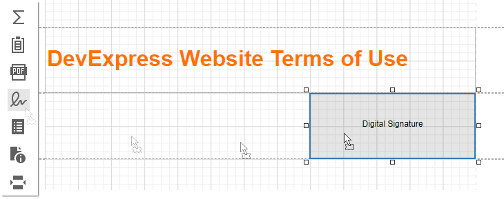

# Reports with a Visual PDF Signature

This tutorial describes how to create a report with a visual PDF signature.

## Create a Report Layout

1. Drop the **Rich Text** control from the report controls Toolbox tab onto the **Detail** band.

    

2. Double-click the control and insert the [DevExpress Website Terms of Use](https://www.devexpress.com/aboutus/legal.xml) text.

    

3. Select the **Detail** band. From the context menu, select the **Insert Report Footer Band** command. Enable the footer band's **Print at Bottom** property.

    

4. Drop the **Pdf Signature** control from the report controls Toolbox tab onto the **Report Footer** band.

    

5. Place the **Label** control to the left of the **Pdf Signature** control and add the following text: _I have read and accept this Website Terms of Use statement_.

    

Open **Preview** to show the result.

## Export and Sign the Report

You can sign a report with a visual signature on export to PDF if an application contains an available signature. To sign the report on export, select a signature from the **Signature** drop-down list in [PDF Export Options](../../document-viewer/exporting/pdf-specific-export-options.md).

You can also sign the exported document in a PDF editor. To do this, follow the steps below:

1. In **Preview**, expand the list with export formats and select **PDF**.

    

2. Open the exported document in a PDF editor and sign it.

    

Save and reopen the document to show the final result.

