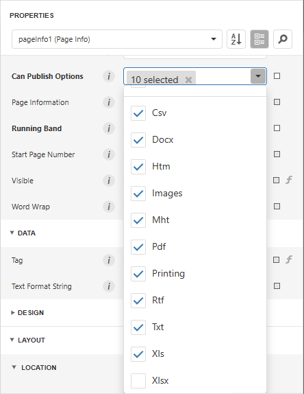
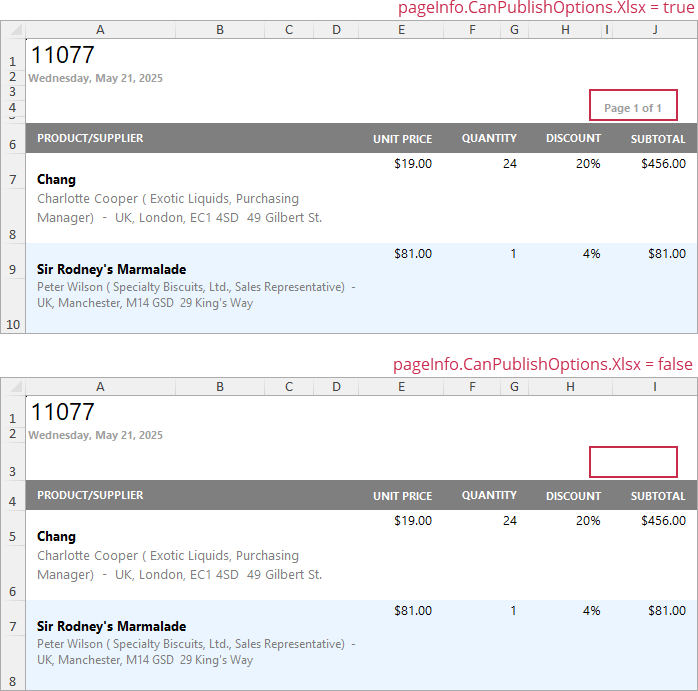
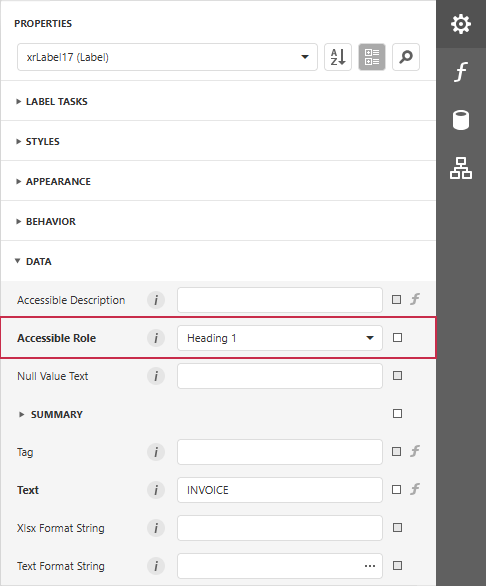
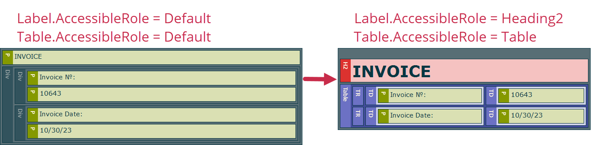

# Preview, Print and Export Reports

## Preview a Report
To switch a report to the print preview mode, click the **Preview** button on the [toolbar](report-designer-tools/toolbar.md). You will see your report populated with data and broken down into pages.

> [!NOTE]
> To learn more about the options available in the print preview mode, refer to the [Document Viewer](../document-viewer.md) section of this documentation.

## Print a Report

When in the Preview mode, you can use toolbar commands to print out your report.

## Export a Report
When in the Preview mode, you can export your report to files in different formats.

The following documents describe the basics of report exporting and format-specific export options.
* [Export a Document](../document-viewer/exporting/export-a-document.md)
* [CSV-Specific Export Options](../document-viewer/exporting/csv-specific-export-options.md)
* [HTML-Specific Export Options](../document-viewer/exporting/html-specific-export-options.md)
* [Image-Specific Export Options](../document-viewer/exporting/image-specific-export-options.md)
* [MHT-Specific Export Options](../document-viewer/exporting/mht-specific-export-options.md)
* [PDF-Specific Export Options](../document-viewer/exporting/pdf-specific-export-options.md)
* [RTF-Specific Export Options](../document-viewer/exporting/rtf-specific-export-options.md)
* [Text-Specific Export Options](../document-viewer/exporting/text-specific-export-options.md)
* [XLS-Specific Export Options](../document-viewer/exporting/xls-specific-export-options.md)
* [XLSX-Specific Export Options](../document-viewer/exporting/xlsx-specific-export-options.md)
* [DOCX-Specific Export Options](../document-viewer/exporting/docx-specific-export-options.md)

## Hide Report Controls in Documents Exported to Specific Formats

You can specify the **Can Publish Options** setting in the Properties grid to exclude report controls from certain export formats.

The following image illustrates the resulting XLXS document with and without page information:

## Export a Report to PDF with Accessible Tags (PDF/UA Compatibility)

You can specify how report elements should be treated by screen readers in the exported PDF document:

Use this table to map report controls to accessibility structure roles in exported PDF files. 

The table describes the following:

- How each control behaves when the **Accessible Role** property is set to **Default**.
- Roles you can assign to ensure that screen readers correctly identify the element's purpose in the exported PDF document.

> [!Tip]
> **Decorative** role means an element is treated as an artifact (outside the tag tree). Use this role only for non-informative visual elements. 

| Element(s) | Default behavior when **Accessible Role** = **Default** | Role you can specify | 
|---|---|---|
| `Label` | No semantic role; treated as a `Div`. | Heading | 
| `Table` | No semantic role; treated as a `Div`. | Table | 
| `Table Row` | No semantic role; treated as a `Div`. | Table Header Row | 
| `Table Cell` | Treated as a paragraph (`P`). | Header Cell | 
| `Watermark` (an image watermark) | Treated as an artifact; excluded from the PDF logical structure. | Figure | 
| `Watermark` (a text watermark) | Treated as an artifact; excluded from the PDF logical structure. | Paragraph |
| `Picture Box`, `Shape`, `Bar Code`, `Zip Code` | Treated as a `Figure`. | Decorative (Artifact) | 

The **Accessible Description** property is not in effect for artifacts.

The following image illustrates the difference between default and specified roles:

