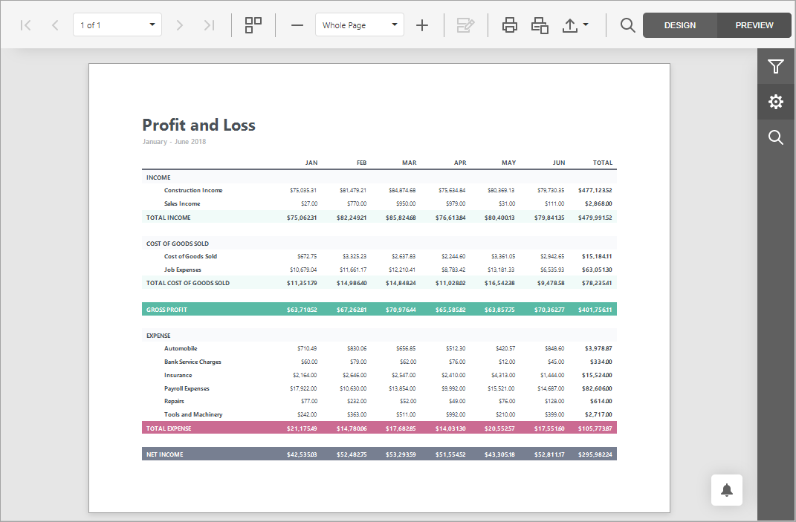
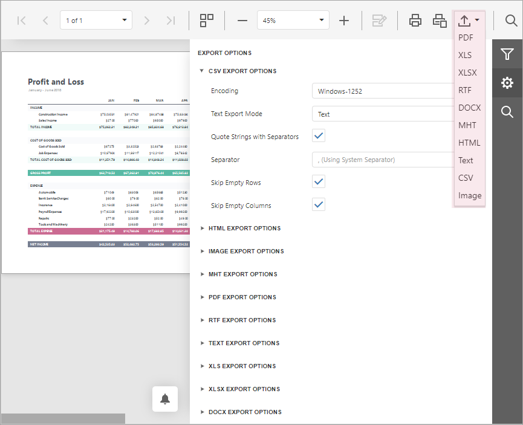
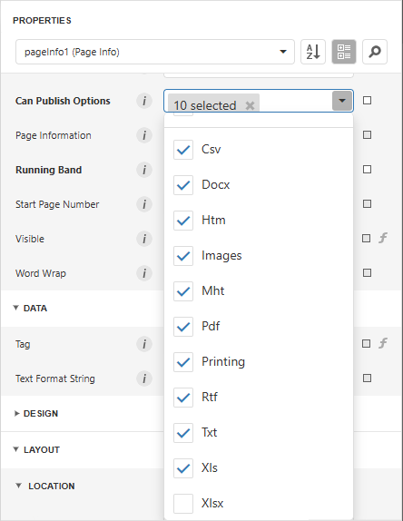
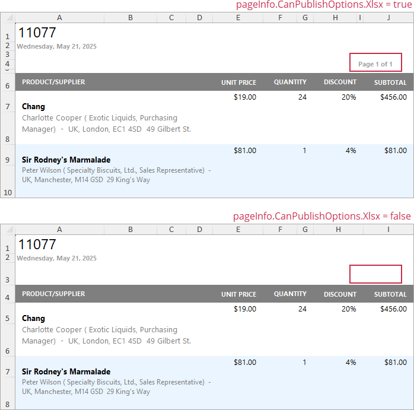
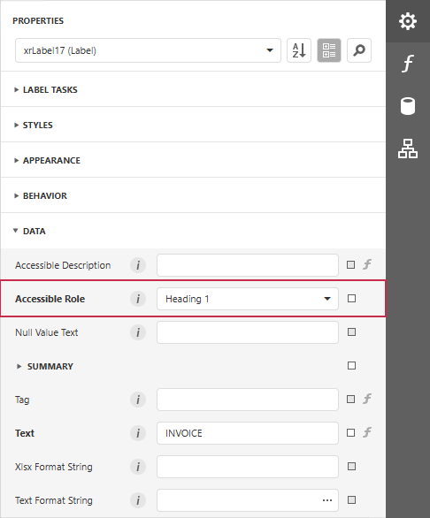
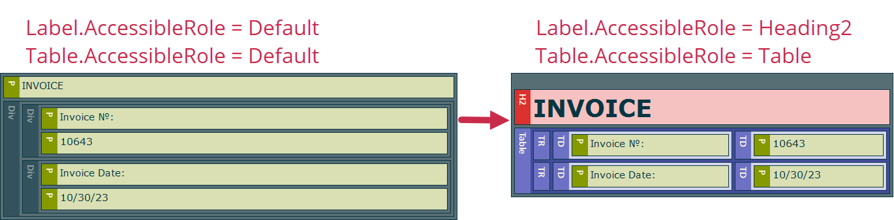
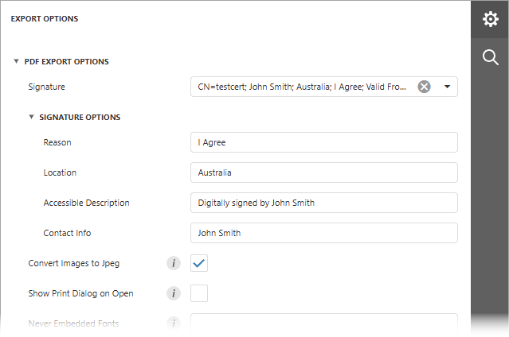
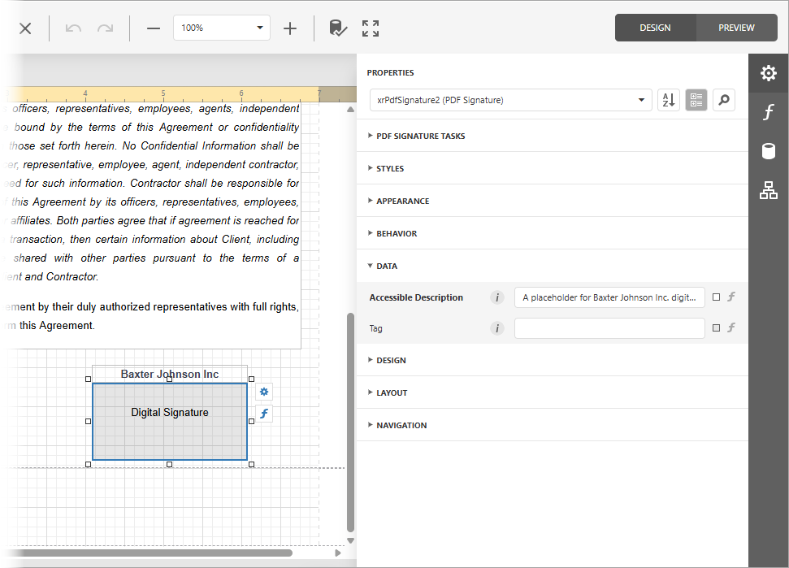
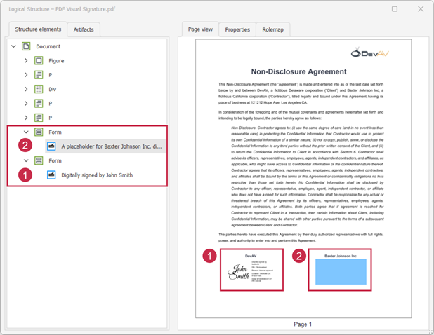

---
title: Preview, Print and Export Reports
author: Anna Vekhina
---
# Preview, Print and Export Reports

## Preview a Report
To switch a report to print preview mode, click the **Preview** button on the [toolbar](report-designer-tools/toolbar.md). You will see your report populated with data and broken down into pages.

> [!NOTE]
> To learn more about  options available in print preview mode, refer to the [Document Viewer](../document-viewer.md) section of this documentation.

## Print a Report

When in Preview mode, you can use toolbar commands to print out your report.

## Export a Report
When in Preview mode, you can export your report to files in different formats.

The following documents describe the basics of report exporting and format-specific export options.
* [Export a Document](../document-viewer/exporting/export-a-document.md)
* [CSV-Specific Export Options](../document-viewer/exporting/csv-specific-export-options.md)
* [HTML-Specific Export Options](../document-viewer/exporting/html-specific-export-options.md)
* [Image-Specific Export Options](../document-viewer/exporting/image-specific-export-options.md)
* [MHT-Specific Export Options](../document-viewer/exporting/mht-specific-export-options.md)
* [PDF-Specific Export Options](../document-viewer/exporting/pdf-specific-export-options.md)
* [RTF-Specific Export Options](../document-viewer/exporting/rtf-specific-export-options.md)
* [Text-Specific Export Options](../document-viewer/exporting/text-specific-export-options.md)
* [XLS-Specific Export Options](../document-viewer/exporting/xls-specific-export-options.md)
* [XLSX-Specific Export Options](../document-viewer/exporting/xlsx-specific-export-options.md)
* [DOCX-Specific Export Options](../document-viewer/exporting/docx-specific-export-options.md)

## Hide Report Controls in Documents Exported to Specific Formats

You can specify the **Can Publish Options** setting in the Properties grid to exclude report controls from export formats of your choosing.

The following image illustrates the resulting XLXS document with and without page information:

## Export a Report to PDF with Accessible Tags (PDF/UA Compatibility)

Use the **Accessible Role** option to specify how report elements should be treated by screen readers in the exported PDF document:

Set the **PDF/UA Compatibility** property to **PDF/UA-1** or **PDF/UA-2** to conform the exported PDF document to the PDF/UA specification. Then, export the report to PDF format.

The following image illustrates [PDF Accessibility Checker (PAC)](https://pac.pdf-accessibility.org/en) output after it processes a PDF/UA-compatible exported document:

Use this table to map report controls to accessibility structure roles in exported PDF files. 

The table describes the following: 

- How each control behaves when the **Accessible Role** property is set to **Default**.
- Roles you can assign to ensure that screen readers correctly identify element purpose in the exported PDF document.

> [!Tip]
> **Decorative** role means an element is treated as an artifact (outside the tag tree). Use this role only for non-informative visual elements. 

| Element(s) | Default behavior when **Accessible Role** = **Default** | Role you can specify | 
|---|---|---|
| `Label` | No semantic role; treated as a `Div`. | Heading | 
| `Table` | No semantic role; treated as a `Div`. | Table | 
| `Table Row` | No semantic role; treated as a `Div`. | Table Header Row | 
| `Table Cell` | Treated as a paragraph (`P`). | Header Cell | 
| `Watermark` (an image watermark) | Treated as an artifact; excluded from the PDF logical structure. | Figure | 
| `Watermark` (a text watermark) | Treated as an artifact; excluded from the PDF logical structure. | Paragraph |
| `Picture Box`, `Shape`, `Bar Code`, `Zip Code` | Treated as a `Figure`. | Decorative (Artifact) | 
| `Page Info` | Treated as an artifact; excluded from the PDF logical structure. | Paragraph (use for meaningful content such as dates or page numbers) |
| `Panel` | Included in the document structure. | Decorative (Artifact) (use for layout-only or purely visual panels) |

The **Accessible Description** property is not in effect for artifacts.

> [!NOTE]
> **Rich Text** content is automatically converted to semantic tags when exported to a tagged PDF: headings become `H1`–`H3`, paragraphs become `P`, lists become `L`/`LI`, images become `Figure`, and tables become `Table`/`TR`/`TH`/`TD`. No role configuration is needed.

The following image illustrates the difference between default and specified roles:

### Digital Signature Accessible Description

You can specify an accessible description for the **PDF Signature** control to help screen readers identify its content.

- **Document Signature**

    If the control displays a document signature, use the **Accessible Description** option in the control's **PDF Signature Options** in the **Export Options** tab:

    

- **Signature Placeholder**

    If the control is a signature placeholder (the document signature is disabled), use the control's **Accessible Description** property:

    

The following image shows both signatures in the PDF tag tree:

### Limitations

* The **Never Embedded Fonts** export option is not supported for PDF/UA-compatible documents.
* If a report contains an **XRPdfContent** control, you cannot export the report to PDF with the PDF/UA option enabled.
* If a report contains editing fields, the exported document does not comply with PDF/UA requirements.
* Hyperlinks are exported without semantic tags required by **PDF/UA-2**.