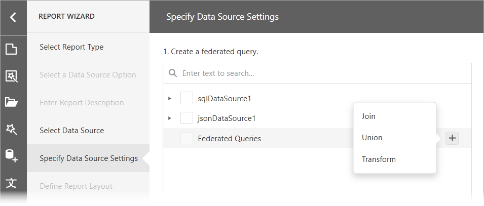

# Specify Data Source Settings (Data Federation)

The wizard appears if you selected **Data Federation** on the start page. On this wizard page, you can create federated queries based on data from other data sources. The **Data Federation** option is available only if a report contains at least one data source.

## Create a Federated Query

### Include Data into Separate Queries

Enable checkboxes for data fields, queries, and entire data sources. The selected items are included in data federation as separate queries.

In the next section, configure master-detail relationships between selected items. To create a master-detail relationship, click the master table's plus button. Next, select the detail table in the list and connect the key fields.

For a detailed tutorial on how to create a federated data source that retrieves data from multiple data sources and sets the master-detail relationship between the queries, refer to the following topics: 

- [Bind a Report to a Federated Master-Detail Data Source](../../../bind-to-data/bind-a-report-to-a-federated-master-detail-data-source.md)

### Combine Data into a Single Query

To combine data from multiple data sources into a single query, hover over the Federated Query string. Click Add query (the + sign) and select one of the query types:

The following query types are available: 

Join 
:   Combines rows from two or more sources based on a clause.
Union and Union All

:   The Union query combines rows from two or more sources into one data set and removes duplicate rows in the merged source. The Union All query does the same, except it does not remove duplicated rows. You can create a union query for data sources if data types of their columns are implicitly converted.

Transformation
:   If a data source contains a complex column (an object), you can transform its properties to display them as separate columns in a flattened view. If one of the data columns is an array, you can unfold its values and display a new data row for every element of the array. When you unfold the column, you can flatten it and create a flattened view.

For instructions on how to bind a report to a Federated Data Source depending on the query type, refer to the following topics: 

- [Bind a Report to a Join-Based Federated Data Source](../../../bind-to-data/bind-a-report-to-a-join-based-federated-data-source.md)
- [Bind a Report to a Union-Based Federated Data Source](../../../bind-to-data/bind-a-report-to-a-union-based-federated-data-source.md)
- [Bind a Report to a Transformation-Based Data Source](../../../bind-to-data/bind-a-report-to-a-transformation-based-data-source.md)