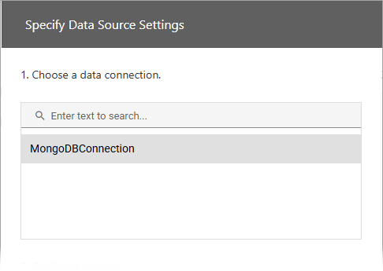
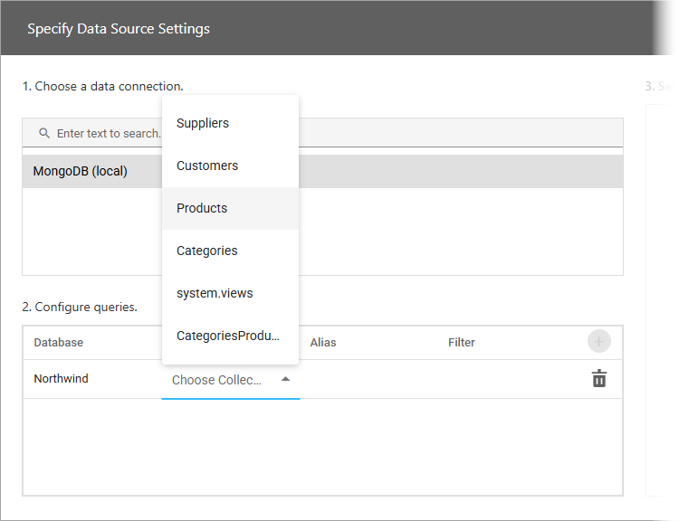
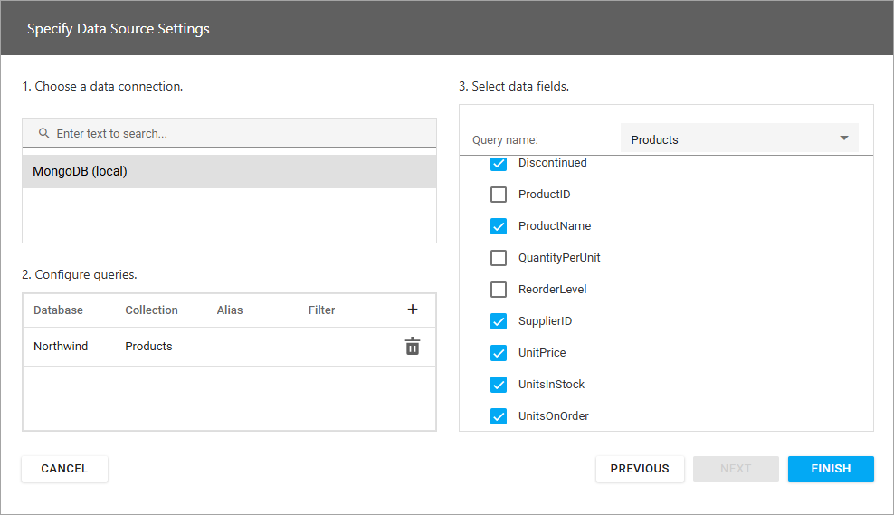

# Specify Data Source Settings (MongoDB)

This page appears when you select **MongoDB** on the start page.

## Choose a Data Connection

Select a connection from the list: 

## Configure Queries

In the next section, configure queries. Click the plus sign to add a new query. Specify the database, collection, and alias.

To add a filter condition to a query, click the ellipsis in the Filter column. Specify the condition in the [Filter Editor](../../filter-editor.md) dialog. 

To delete a query, click the Delete button.

## Select Data Fields

Use check boxes to select required data fields: 

Click **Finish** to add the data source.
