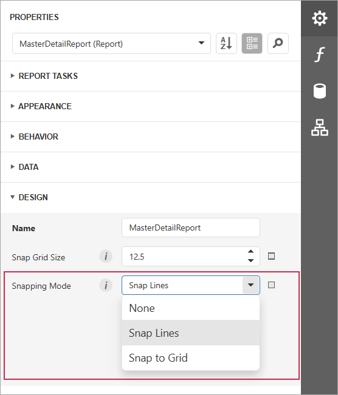

# Arrange Report Controls

You can align report controls to each other, change the report element's size, change the stacked elements' order, and so on. Select a command from the control's context menu:

The design surface displays a visual grid that allows you to determine elements' size and location in a report. Use the **Snap Grid Size** property to customize the grid's size.

										
You can use the **Align to Grid** action to align the selected controls to the grid's cells.

The Report Designer displays snap lines when you move or resize report controls. These lines appear around the report controls and indicate the distance to other report elements (controls and bands).

Use the report's **Snapping Mode** property to enable automatic report control snapping to a grid or snap lines:

The following values are available:

- **None**

    No snapping is used.

- **Snap to Grid**
    
    Aligns a report element to the report snap grid.

    The design surface displays a visual grid that allows you to determine elements' size and location in a report. Use the **Snap Grid Size** property to customize the grid's size.

- **Snap Lines**

    Aligns a report element using snap lines.

    The Report Designer displays snap lines when you move or resize report controls. These lines appear around the report controls and indicate the distance to other report elements (controls and bands).

To temporarily ignore snapping, hold down ALT when you move or resize controls using the mouse.
