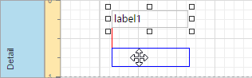
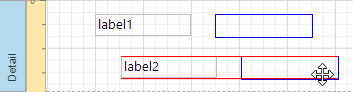
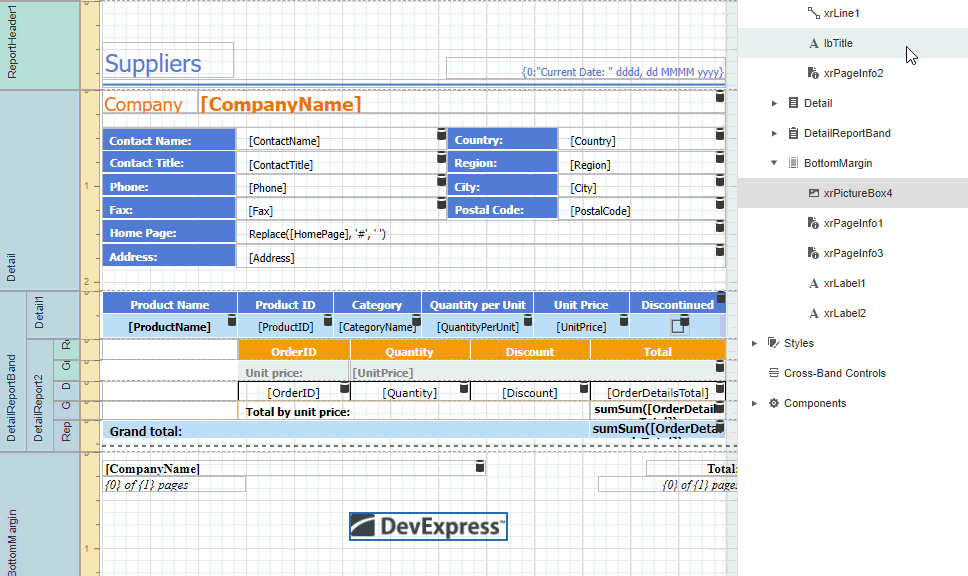
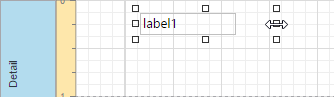
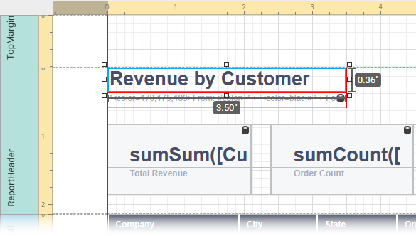
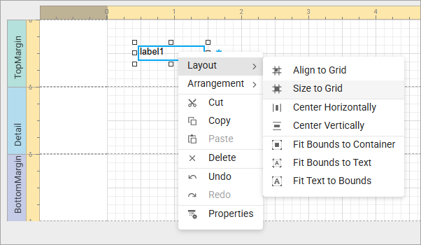
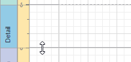

# Move and Resize Report Elements

## Move Report Elements

You can use the mouse or keyboard to move a report control to a new location.

You can also [select multiple controls](select-report-elements-and-access-their-settings.md) and move them in the same way as individual report controls.

You can also use the [Report Explorer](../../report-designer-tools/ui-panels/report-explorer.md) to move a control to other bands (except **Detail Report Band**), or into a **Panel** or **Table Cell** controls. Select a control and drag it within the Report Explorer. The drop targets are highlighted when you drag the control over them.

You can also use the Report Explorer to move table cells inside of a table:

> [!NOTE]
> You can drag the **Table Of Contents** only to the **Report Header Band** and **Report Footer Band**.

## Resize Report Elements

Select a control and then drag a rectangle drawn on its edge or corner to resize it.

Dimensions notations appear when you resize a control. They indicate the control's width and height in report units: 

Use the **Size to Grid** command to resize a control to the report's **Snap Grid**.

Drag a band's header strip to resize the band.

See [Arrange Report Controls](arrange-report-controls.md) for information about tools that help you align report controls to each other and layout edges.
