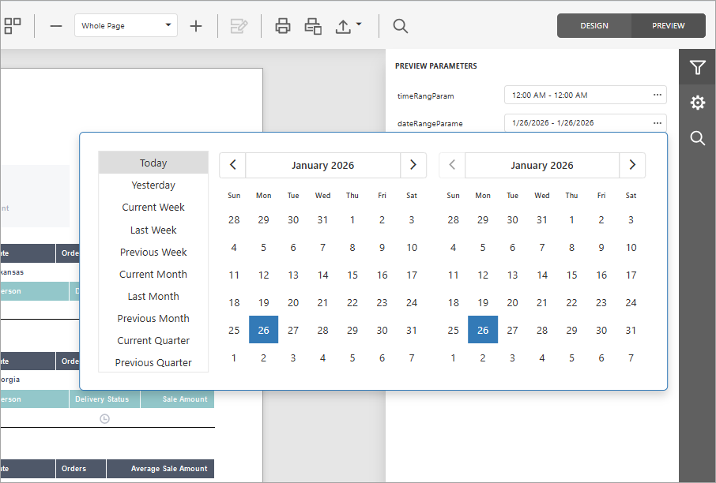
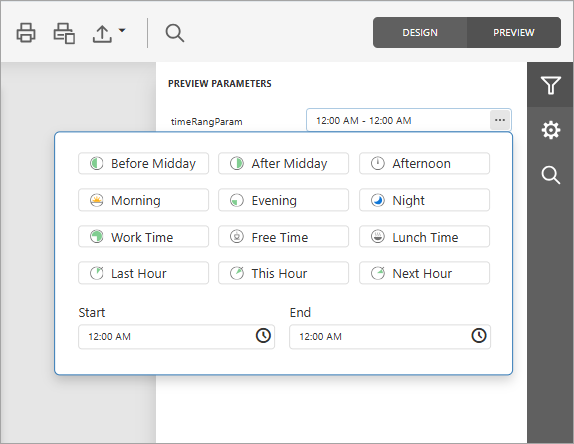
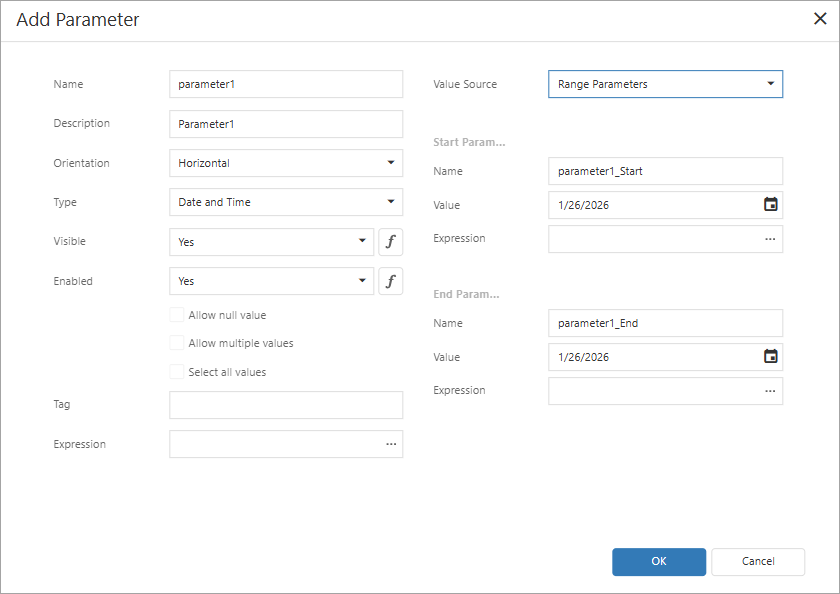
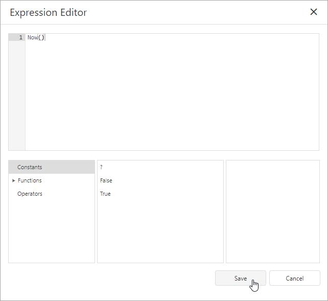
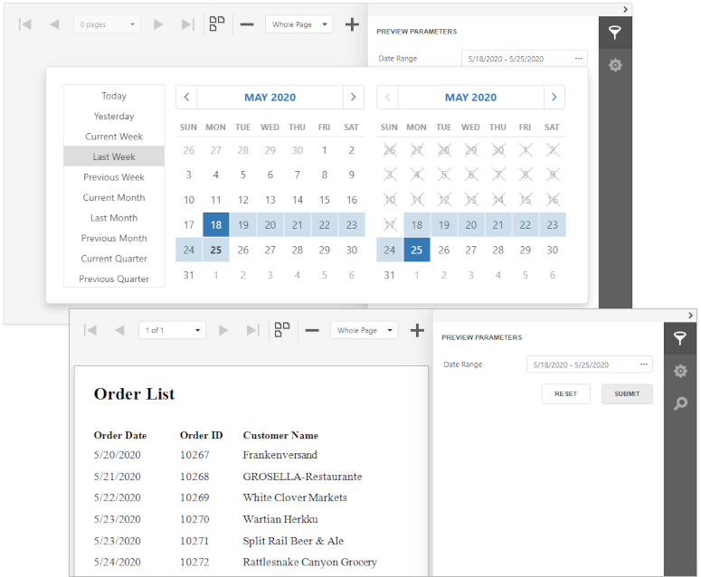
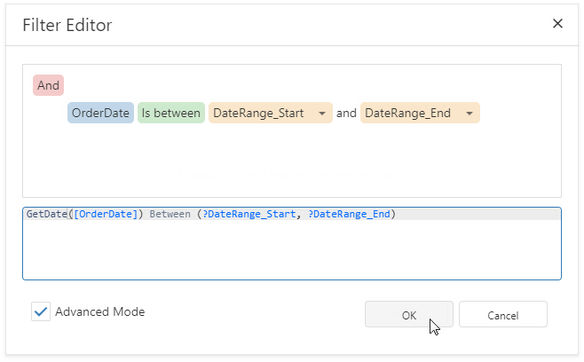

# Range Report Parameters

This topic describes how to create date and time range parameters and filter report data by specified dates.

|Date Range Parameter Editor| Time Range Parameter Editor|
|--|--|
|||

## Create a Range Parameter in the Report Designer

Follow the steps below to add a range parameter to a report in the [Report Designer](../first-look-at-the-report-designer.md):

1. [Create a report parameter](create-a-report-parameter.md). In the **Add Parameter** dialog, specify parameter options:

    - **Parameter type**: _Date and Time_,  _Date_, or _Time_
    - **Value Source**: _Range Parameters_
    
    The **Start Parameter** and **End Parameter** sections allow you to configure options for a date or time range:

    

2. You can change the _Name_ and initial static _Value_ for the **Start Parameter** and **End Parameter**. To specify an [expression](../use-expressions.md) instead of a static value, click the **Expression** option's ellipsis button and use the **Expression Editor** dialog.

    

3. [Reference the created range parameter](reference-report-parameters.md).  You can reference this parameter in the report's filter string to [filter report data](../shape-report-data/filter-data/filter-data-at-the-report-level.md) by the created date or time range. Select the report, click the **FilterString**'s ellipsis button in the **Properties window**, and construct a filter condition in the invoked **FilterString Editor**.

    We recommend that you use the following functions with range parameters in expressions and filter strings:

    - `InDateRange(Date, FromDate, ToDate)` - equivalent to the `FromDate <= Date && Value < Date` expression.
    - `InTimeRange(Time, FromTime, ToTime)` - equivalent to the `FromTime <= Time && Time < ToTime` expression (including cases where the range spans midnight, such as 23:00-01:00).
    - `OutOfTimeRange(Time, FromTime, ToTime)` - equivalent to the `FromTime > Time || Time => ToTime` expression (including cases where the range spans midnight, such as 23:00-01:00).

    The example below filters report data by the following filter string:

    `InDateRange([ShippedDate], ?paramDateRange_Start, ?paramDateRange_End) `

When you switch to the report's **Print Preview** tab, the [Parameters panel](parameters-panel.md) displays the range parameter. After you submit start and end values, the report document shows filtered data.

Start and end parameter values store the selected day's midnight time. For instance, if you choose _10/15/2019_, the *DateTime* value is _10/15/2019 12:00:00 AM_. If your date fields include non-midnight times, records for the end date _10/15/2019_ are excluded from the report. To include data for the 10/15/2019 date, use the **GetDate()** function in the **FilterString Editor**.  

