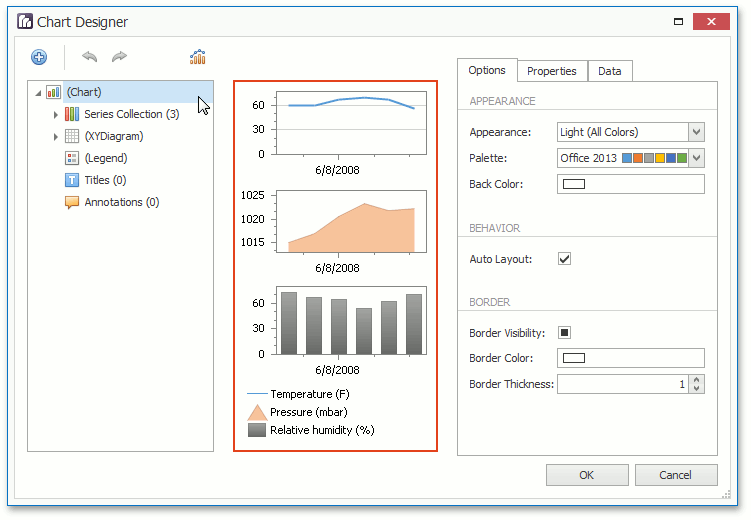
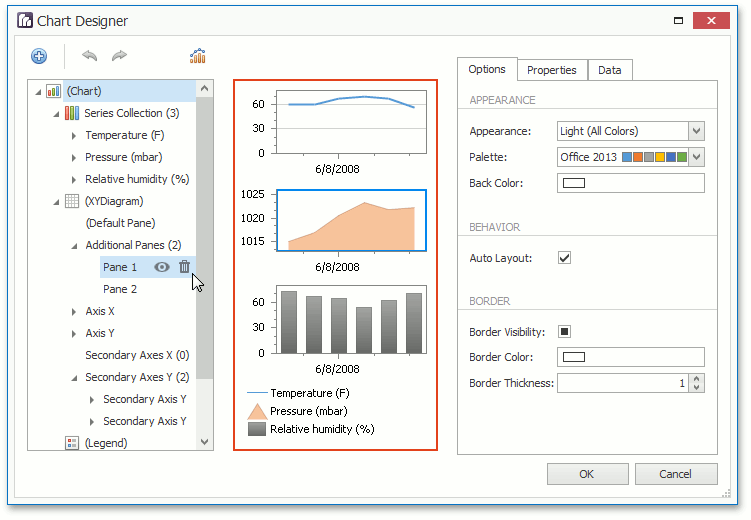
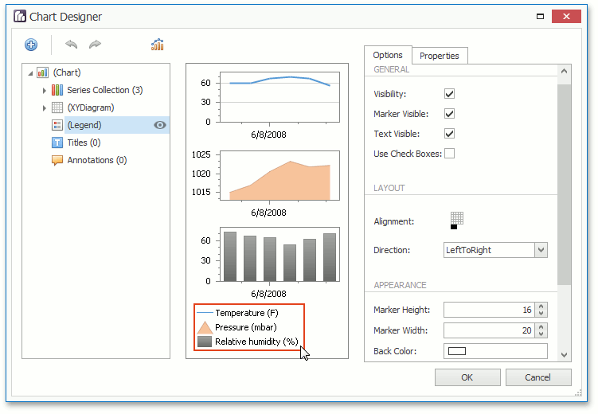
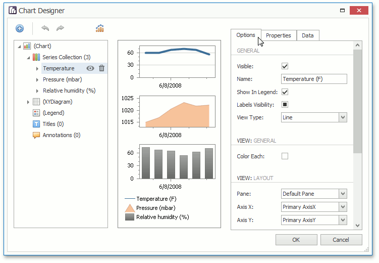
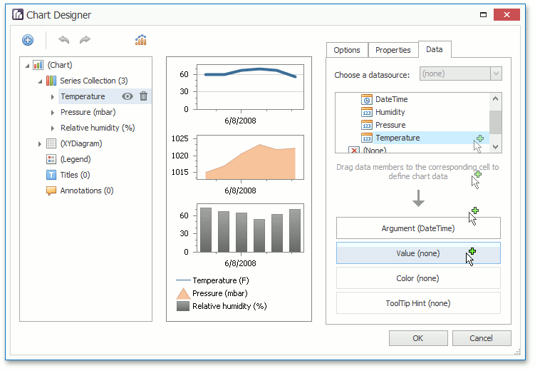

# Chart Designer
Use the Chart Designer dialog to quickly and easily customize a chart, or create a new one.

The Chart Designer is organized into three main areas, which are represented below.

## <a name="chartelementstree"/>Chart Elements Tree
The **Chart Elements Tree** allows you to quickly select chart elements, change the structure of a chart  (add or delete elements and change their visibility) and also represent chart structure. When you locate an element in the tree, it is highlighted in the central area. If you click the element, then its settings will be displayed in the **Customization Tabs** area.

## <a name="chartcontrolappearance"/>Chart Control Appearance
The **Chart Control Appearance** area allows you to see how the chart looks. Moreover, it allows you to select an item, whose settings will be displayed in the **Customization Tabs** area.

## <a name="customizationtabs"/>Customization Tabs
The **Customization Tabs** area allows you to customize chart element settings. Settings are separated by three tabs.
* The **Options Tab** contains commonly used element settings.
	
	
* The **Properties Tab** contains all settings of a chart element.
	
	
* The **Data Tab** contains settings, which allow you to specify data source members used to plot series or other data settings of a chart element (for example, the series points values if the series is not assigned with data).
	
	

> [!NOTE]
> For several chart elements, the **Customization Tabs** area may not contain all tabs from the Tabs list represented above.