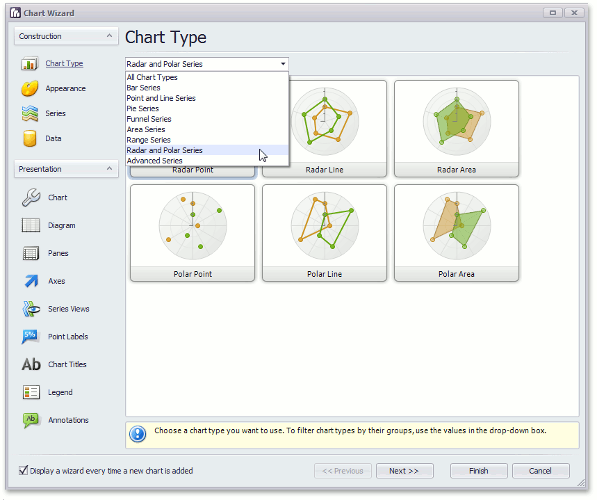

Use the chart wizard dialog to quickly and easily create a new chart, or modify an existing one.

The Chart Wizard contains the following pages.

**Construction** group
* [Chart Type Page](../../../interface-elements-for-desktop/articles/charting/chart-wizard/chart-type-page.md)
* [Appearance Page](../../../interface-elements-for-desktop/articles/charting/chart-wizard/appearance-page.md)
* [Series Page](../../../interface-elements-for-desktop/articles/charting/chart-wizard/series-page.md)
* [Data Page](../../../interface-elements-for-desktop/articles/charting/chart-wizard/data-page.md)

**Presentation** group
* [Chart Page](../../../interface-elements-for-desktop/articles/charting/chart-wizard/chart-page.md)
* [Diagram Page](../../../interface-elements-for-desktop/articles/charting/chart-wizard/diagram-page.md)
* [Panes Page](../../../interface-elements-for-desktop/articles/charting/chart-wizard/panes-page.md)
* [Axes Page](../../../interface-elements-for-desktop/articles/charting/chart-wizard/axes-page.md)
* [Series Views Page](../../../interface-elements-for-desktop/articles/charting/chart-wizard/series-views-page.md)
* [Point Labels Page](../../../interface-elements-for-desktop/articles/charting/chart-wizard/point-labels-page.md)
* [Chart Titles Page](../../../interface-elements-for-desktop/articles/charting/chart-wizard/chart-titles-page.md)
* [Legend Page](../../../interface-elements-for-desktop/articles/charting/chart-wizard/legend-page.md)
* [Annotations Page](../../../interface-elements-for-desktop/articles/charting/chart-wizard/annotations-page.md)

To navigate through the Chart Wizard's pages, use the navigation bar or the  and  buttons.

To complete the chart, use the  button,  or the  button, to cancel all changes.

Use the "Display a wizard every time a new chart is added" option to specify whether or not a chart wizard should appear when you add  a new chart to the windows form.