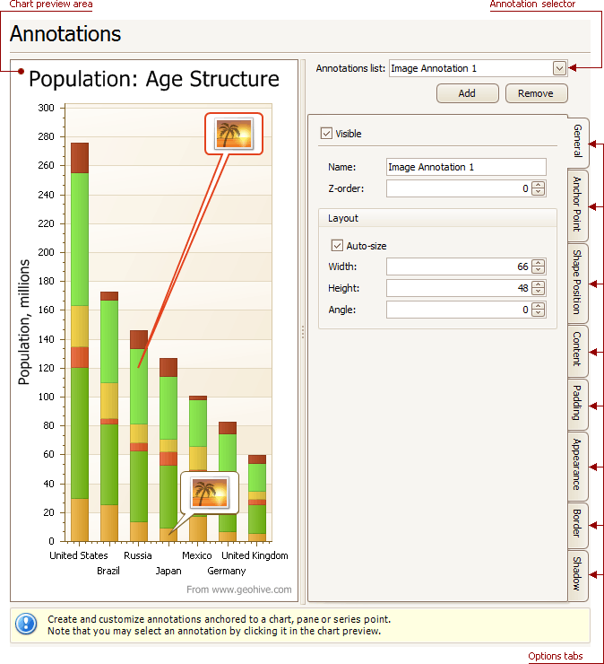

# Annotations Page
## Tasks
* Create and customize image and text annotations.

## Page Elements

**Chart preview area**

Previews a chart's layout.

**Annotation selector**

Specifies an annotation to be created and/or customized.

Note that you can select an annotation directly on the chart preview area.

**Options tabs**

The following tabs are available on this page.
* **General**
	
	Specify an annotation's name, adjust its visibility, z-order and layout.
* **Anchor Point**
	
	Choose an element to anchor to (chart, pane, or series point), and adjust the corresponding options.
* **Shape Position**
	
	Choose an annotation's shape position type (free or relative), and adjust the corresponding options.
* **Content**
	
	Depending on an annotation's type (text or image), specify its content.
* **Padding**
	
	Specify an annotation's inner indents.
* **Appearance**
	
	Adjust an annotation's background color, fill style, shape and connector options.
* **Border**
	
	Specify visibility, color and thickness of an annotation's borders.
* **Shadow**
	
	Specifies visibility, color and size of an annotation's shadow.