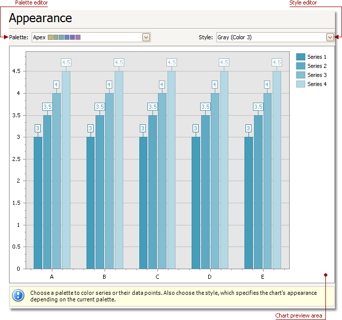
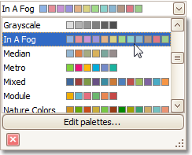
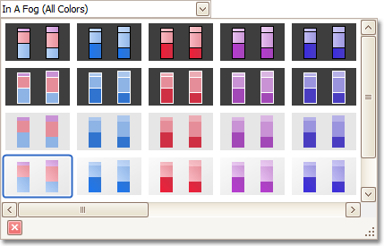

# Appearance Page
## Tasks
* Choose a palette to color a series.
* Choose the style specifying the chart's appearance.

## Page Elements

**Chart preview area**

Previews a chart's layout.

**Palette Editor**

Specifies a palette to color a series.

**Style Editor**

Specifies the style determining the chart's appearance, depending on the selected palette.

