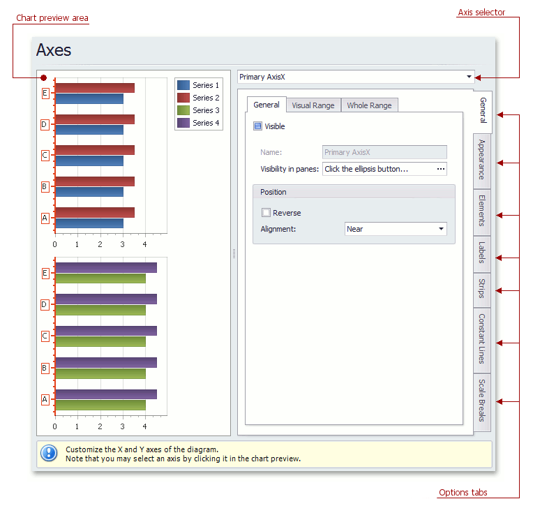

# Axes Page
## Tasks
* Customize axes properties;
* Customize the appearance of axis labels;
* Add a constant line and a strip to an axis;
* Enable automatic and manual scale breaks.

## Page Elements

**Chart preview area**

Previews a chart's layout.

Note that you can select an axis to be modified on the chart preview area directly.

**Axis selector**

Specifies an axis to be customized.

**Options tabs**

The following tabs are available on this page.
* **General**
	
	Specifies visibility, position, range and format properties.
* **Appearance**
	
	Defines color, thickness and interlacing options.
* **Elements**
	
	Customizes title, tickmarks and grid line properties.
* **Labels**
	
	Specifies position and text for automatically created labels, or allows custom labels to be defined.
* **Strips**
	
	Allows you to create strips, define their visibility, name, limits, appearance, etc.
* **Constant Lines**
	
	Allows you to create constant lines, specify whether the constant line should be checkable or checked in a legend, define their visibility, name, value, legend text, appearance, title, etc.
* **Scale Breaks**
	
	Allows you to enable automatic and / or create custom scale breaks, and define their appearance.