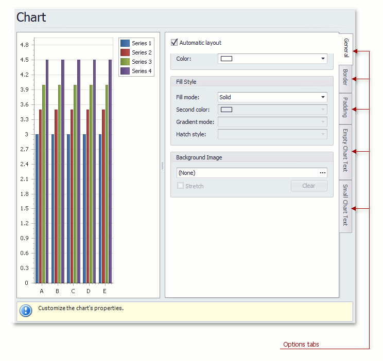

# Chart Page
## Tasks
* Define a chart's background color and background image.

## Page Elements

**Chart preview area**

Previews a chart's layout.

**Options tabs**

The following  tabs are available on this page.
* **General**
	
	Specifies a chart's automatic layout, chart background color, fill style and background image.
* **Border**
	
	Specifies a border's color, thickness and visibility.
* **Padding**
	
	Specifies the diagram's inner indents.
* **Empty Chart Text**
	
	Specifies the message displayed in the chart when there's no data to display.
* **Small Chart Text**
	
	Specifies the message displayed in the chart, when the chart size is too small to fit the diagram.