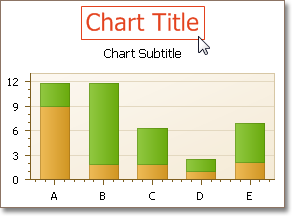

# Chart Titles Page
## Tasks
* Create chart titles;
* Enable the word-wrapping for lengthy chart titles;
* Customize the appearance and position of chart titles.

## Page Elements

**Chart preview area**

Previews a chart's layout.

Note that you can select chart titles to be modified in the chart preview area directly.

**Titles management section**

Allows you to add or remove titles from the titles list, and choose a title to be customized.

**Options tabs**

The following tabs are available on this page.
* **Text**
	
	Sets a text for the selected chart title. Note that the basic HTML formatting is supported for chart titles.
* **General**
	
	Specifies a title's visibility, alignment and font options, and determines whether the word-wrapping is enabled for a title.