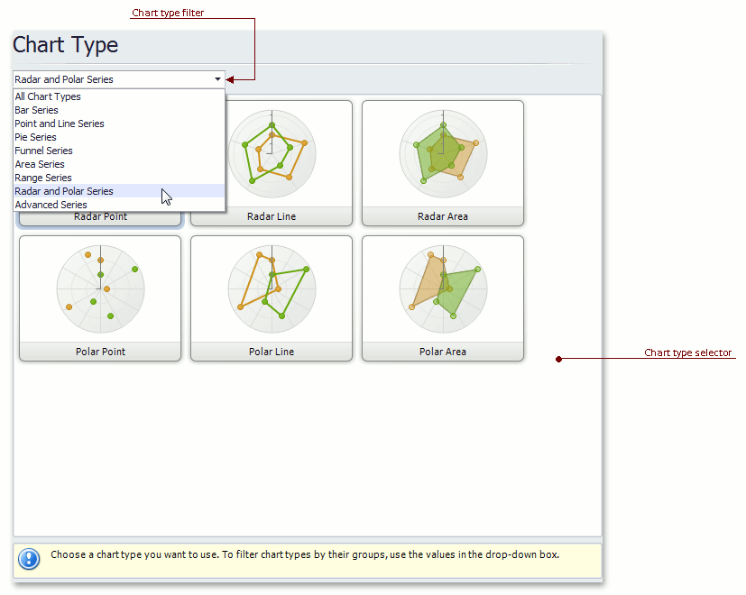

# Chart Type Page
## Tasks
* Choose a chart type.

## Page Elements

**Chart type selector**

Contains icons representing chart types. Click an  icon to choose the appropriate chart type.

**Chart type filter**

Filters chart types available in the **Chart type selector**. The following chart filters are available:
* **All Chart Types**.
* **Bar Series** (Bar, Stacked Bar, 100% Stacked Bar, Side-By-Side Stacked Bar, 100% Side-By-Side Stacked Bar, 3D Bar, 3D Stacked Bar, 3D 100% Stacked Bar, 3D Side-By-Side Stacked Bar, 3D 100% Side-By-Side Stacked Bar and Manhattan Bar).
* **Point and Line Series** (Point, Bubble, Line, Stacked Line, 100% Stacked Line, Step Line,  Spline, Scatter Line,  Swift Plot, 3D Line, 3D Stacked Line, 3D 100% Stacked Line, 3D Step Line and 3D Spline).
* **Pie Series** (Pie, Doughnut, 3D Pie and 3D Doughnut).
* **Funnel Series** (Funnel and 3D Funnel).
* **Area Series** (Area, Stacked Area, 100% Stacked Area, Step Area, Spline Area, Spline Area Stacked, 100% Stacked Spline Area, 3D Area, 3D Stacked Area, 3D 100% Stacked Area,  3D Step Area, 3D Spline Area, 3D Spline Stacked Area and 3D 100% Stacked Spline Area).
* **Range Series** (Range Bar, Side-By-Side Range Bar, Range Area, 3D Range Area).
* **Radar and Polar Series** (Radar Point, Radar Line, Radar Area, Polar Point, Polar Line and Polar Area).
* **Advanced Series** (Stock, Candle Stick, Gantt, Side-By-Side Gantt).